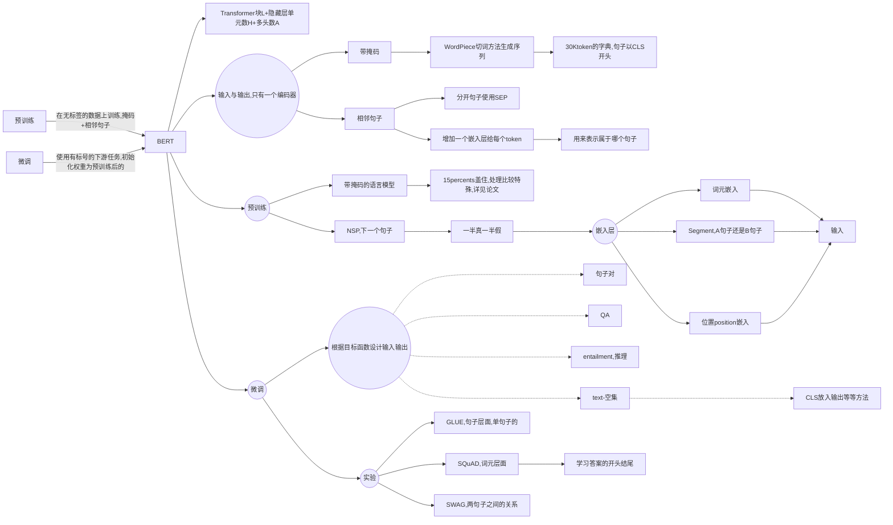

## CNN

### [ImageNet Classification with Deep Convolutional Neural Networks](https://github.com/Gary-code/paper-reading/blob/main/ImageNet%20Classification%20with%20Deep%20Convolutional.pdf)

> AlexNet


* 数据集是1m的图片+1000类别（完整的有8.9m+1万类别）
  * $256 \times 256$的channels数为3的数据集

#### 数据处理

* 避免过拟合
  * 数据增强
    * 随机裁$224 \times 224$的出来
    * 通道变换
* DropOut
  * 根据后来研究表明就等价一个$l2$正则项

#### 模型训练

* 使用ReLU，简单好用
* SGD

这篇论文写作格式有些不好，没有结论，不过这是深度学习的开创性工作。

### [Deep Residual Learning for Image Recognition](https://github.com/Gary-code/paper-reading/blob/main/Deep%20Residual%20Learning%20for%20Image%20Recognition.pdf)

> ResNet

#### 提出问题

* 为什么深度up，精度下降
* SGD找不到，并不是overfitting

#### 理论

$f(x) = H(x) + x$

* Shortcut Connections
* 实际上他没从根本理论上解释为什么这个设计可以解决问题，但作为CV文章还可以接受

#### 实现

* 数据增强
  * [256, 480] resize,随机性更好
  * BN
  * 测试集
    * 当中10-crop testing ？？？
    * resize多个，但感觉太贵，主要用来刷榜
* ResNet-50 与 Resnet-30设计不一样，为了保证计算开销差不多
  * 256-d -> 64 -> 64 -> 256
    * 第一个64和最后256为$1 \times 1$卷积，用来变换通道数
    * 为了学到更多信息

* 为了保证维度可以做相加

  * padding，填0

    ```python
    f = [[[[1,2,3,4],[5,6,7,8]]]]
    x = [[[[1,2],[3,4]]]]
    """x--->[[[[0,1,2,0],[0,3,4,0]]]]"""
    x = tensorflow.pad(x, [[0,0],[0,0],[0,0],[(out_filter-in_filter)//2, (out_filter-in_filter)//2]])
    x = f + x
    ```

  * projection($1 \times 1$卷积)

    * 用于增加维度
    * 所有都使用一下，不过太贵了不划算！


#### 写作

* Abstract：关注重点是什么问题，show了我们大概是什么，数据集上成绩如何
* Intro：我们的breakthrough+经典放图+提问题，回答问题。结果展示+解释Resnet设计扩充了Abstract。让不敢兴趣或者不是这个领域的人可以戛然而止，非常好
* Related Word：介绍一下前人工作，和我们工作的对比


## NLP

### [Attention is All you need](https://github.com/Gary-code/paper-reading/blob/main/Attention%20Is%20All%20You%20Need.pdf)

> Transformer

#### 特性

* 泛化性好(generalizes well)

#### 技术细节

* 做机器翻译的任务

* Encoder and decoder

  * Encoder

    * 两个sub-layer
    * 输入 dimension: $d_{model} = 512$
    * Layer normalization

    

  * Decoder

    * 带掩码的attention
    * 线性输出层=> softmax

* **Attention**

  * 输出为value的加权和，权重从KV相似性计算得来
  * Scaled Dot-Product
    * $Attention(Q, K, V) = \text{softmax}(\frac{QK^T}{\sqrt {d_k}}V)$
      * $Q : n \times d_k$
      * $K : m \times d_k$
      * $V : m \times d_V$
      * output:  $n \times d_v$
      * softmax作用在输出的每一行
      * 除以$d_k$避免两端梯度太小无法训练！！！
    * 其他Attention： 加性Attention，可用于三个维度不一致
    * Decoder当中带掩码，权重为-inf（因为不能未卜先知）
  * 多头注意力
    * 投影到不通过Linear（学到不同的模式）
    * 分别计算内积
    * Concat
    * Linear
    * 可利用大矩阵乘法并行计算！

* Posision-wise Feed-Forward Networks（实际上为一个MLP）

  * 用来切分位置
  * 每个词作用于同一个MLP
  * $FFN(x) = max(0, xW_1 + b_1)W_2 + b_2$ 512 ->2048;2048->512

* Embedding

  * 词元 -> 词向量
  * 因为学到$l2-norm$太小，所以权重$\times \sqrt{d_{model}}$

*  Positional Encoding

  * 在输入当中加入时序信息


#### 训练

* 正则化：大量Dropout， Label Smoothing 很小
* 同一词根同一token，字典在两种语言中共享（因为embedding权重一样）
* 4.5 million句子对


#### 写作

* 很简洁的一篇文章
* 没有太多写作技巧
* 理论解释较为欠缺
* 要讲好一个故事，为什么做这个事情，设计理念是什么，对文章的思考


#### 未来展望

* 我们对Transformer理论仍在初期阶段
* 迁移到很多CV的领域也可用
* 因为人对时序信息是多膜体的，Transformer也努力做到和人类似！


### [BERT: Pre-training of Deep Bidirectiional Transformers for Language Understanding](https://github.com/Gary-code/paper-reading/blob/main/BERT%EF%BC%9APre-training%20of%20Deep%20Bidirectional%20Transformers%20for.pdf)

> BERT， 代表NLP真的可以做预训练了
>
> * 过去三年最重要的NLP论文

#### 摘要

> 这是一篇非常标准的摘要

1. 介绍区别（双向）
2. 泛化性好
3. 数据精度
   1. 绝对精度
   2. 相对精度

#### 前期工作

* 任务level

  * token level
  * sentence level

* 过往的方法

  * 基于特征 feature-based
    * ELMO词嵌入
    * 基于RNN的
  * 微调的 fine-tuning
    * Transformer-> GPT
    * 单向的，现在预测未来
  * 两个方法都是同目标函数+单向的

* 局限性=> 我们的方法

  * 看完整的句子（双向）
  * 带掩码的语言模型，类似于完型填空
  * 看原文中两句子是否相邻
  * **均为无监督的学习**

* 论文贡献

  * 双向性，对比以前的数据精度
  * 微调，下游任务的表现

  

#### 模型架构




#### 展望

* 开启了大模型的开端，亿级别的参数
* 基于前人工作，但效果非常好
* 微调可用于很多NLP任务

#### 写作

* 中规中矩的一篇文章
* 简单，暴力，效果好
* 要多些贡献了什么，失去了什么
  * 生成类问题使用BERT较难

