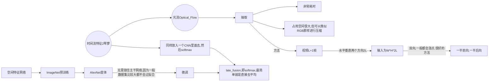
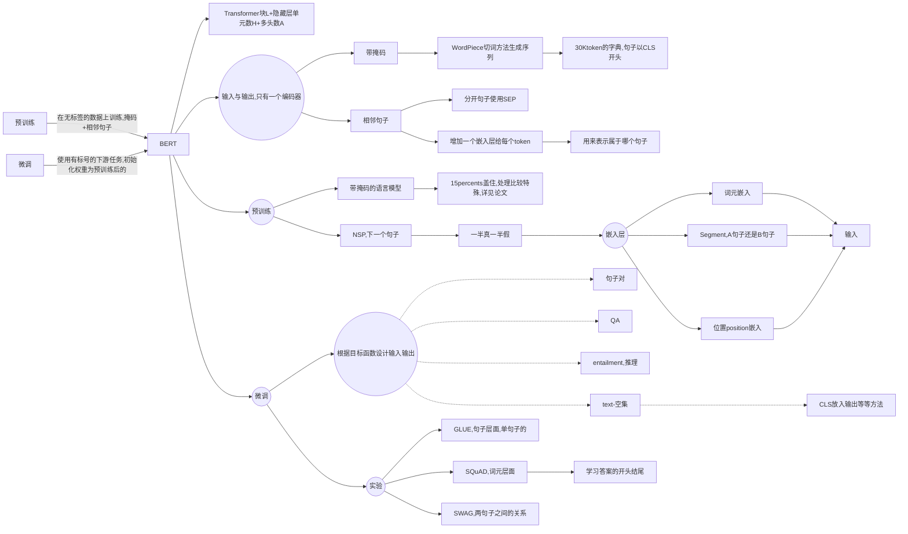
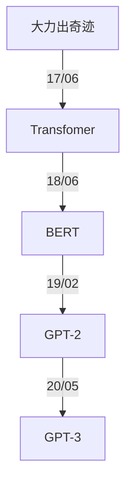
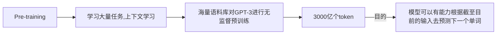
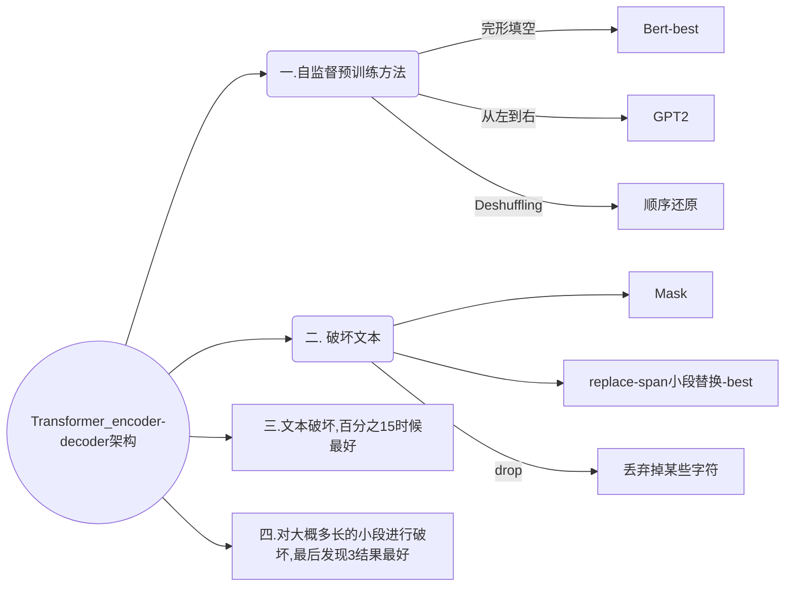
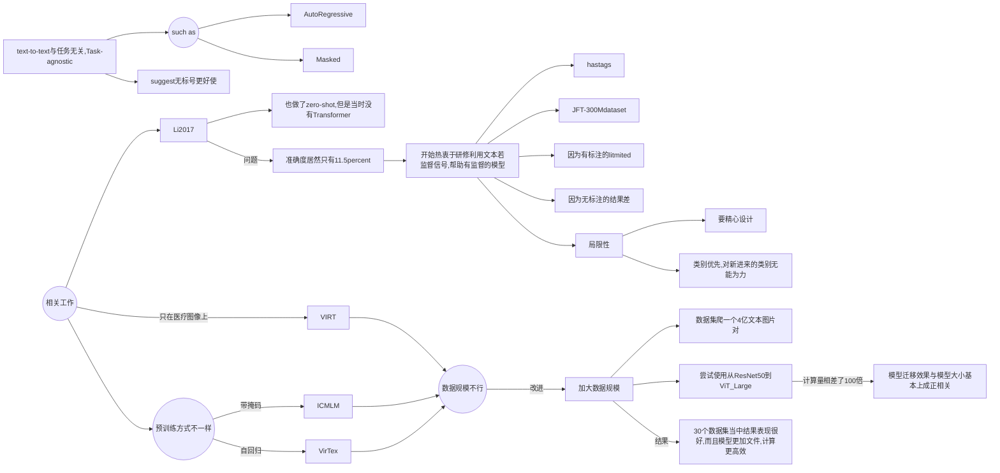
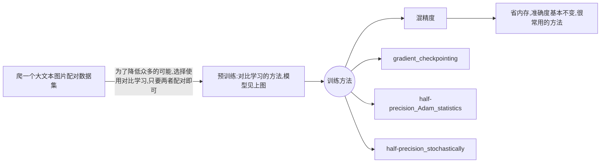
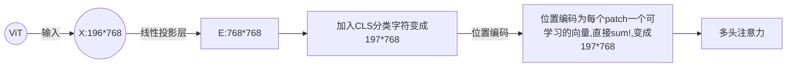
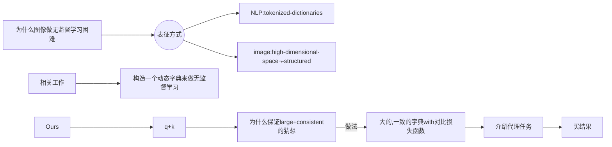

# Neural Network Paper Tutorial, Reading and Notes

This repository contains a list of tutorials, papers, notes of **Neural Network**. If you found any error, please don't hesitate to open an issue or pull request. I will also add some code and other information of these awesome paper.

[TOC]


## :fire: CNN

| 日期     | 标题                                                         | 说明             |
| -------- | ------------------------------------------------------------ | ---------------- |
| 02/13/22 | [AlexNet](https://papers.nips.cc/paper/2012/file/c399862d3b9d6b76c8436e924a68c45b-Paper.pdf) | 深度学习开山之作 |
| 02/13/22 | [ResNet](https://arxiv.org/abs/1512.03385)                   | 残差神经网络     |
| 03/18/22 | [Two-Stream](https://proceedings.neurips.cc/paper/2014/file/00ec53c4682d36f5c4359f4ae7bd7ba1-Paper.pdf) | 视频理解开山之作 |


### AlexNet

[[NIPS 2012] ImageNet Classification with Deep Convolutional Neural Networks](https://papers.nips.cc/paper/2012/file/c399862d3b9d6b76c8436e924a68c45b-Paper.pdf)

* 数据集是1m的图片+1000类别（完整的有8.9m+1万类别）
  * $256 \times 256$的channels数为3的数据集

**数据处理**

* 避免过拟合
  * 数据增强
    * 随机裁$224 \times 224$的出来
    * 通道变换
* DropOut
  * 根据后来研究表明就等价一个$l2$正则项

**模型训练**

* 使用ReLU，简单好用
* SGD

这篇论文写作格式有些不好，没有结论，不过这是深度学习的开创性工作。

### ResNet

[[CVPR 2015]Deep Residual Learning for Image Recognition](https://arxiv.org/abs/1512.03385)

> ResNet

**提出问题**

* 为什么深度up，精度下降
* SGD找不到，并不是overfitting

**理论**

$f(x) = H(x) + x$

* Shortcut Connections
* 实际上他没从根本理论上解释为什么这个设计可以解决问题，但作为CV文章还可以接受

**实现**

* 数据增强
  * [256, 480] resize,随机性更好
  * BN
  * 测试集
    * 当中10-crop testing ？？？
    * resize多个，但感觉太贵，主要用来刷榜
* ResNet-50 与 Resnet-30设计不一样，为了保证计算开销差不多
  * 256-d -> 64 -> 64 -> 256
    * 第一个64和最后256为$1 \times 1$卷积，用来变换通道数
    * 为了学到更多信息

* 为了保证维度可以做相加

  * padding，填0

    ```python
    f = [[[[1,2,3,4],[5,6,7,8]]]]
    x = [[[[1,2],[3,4]]]]
    """x--->[[[[0,1,2,0],[0,3,4,0]]]]"""
    x = tensorflow.pad(x, [[0,0],[0,0],[0,0],[(out_filter-in_filter)//2, (out_filter-in_filter)//2]])
    x = f + x
    ```

  * projection($1 \times 1$卷积)

    * 用于增加维度
    * 所有都使用一下，不过太贵了不划算！


**写作**

* Abstract：关注重点是什么问题，show了我们大概是什么，数据集上成绩如何
* Intro：我们的breakthrough+经典放图+提问题，回答问题。结果展示+解释Resnet设计扩充了Abstract。让不敢兴趣或者不是这个领域的人可以戛然而止，非常好
* Related Word：介绍一下前人工作，和我们工作的对比


### Two-stream Network

[[NIPS 2014]Two-Stream Convolutional Networks for Action Recognition in Videos](https://proceedings.neurips.cc/paper/2014/file/00ec53c4682d36f5c4359f4ae7bd7ba1-Paper.pdf)

> * 视频理解分类开山之作
> * 双流神经网络

**过去问题**

* 一个CNN一般学不到这种动作信息，比手工特征还要差20%
* 既然学不了，我们就教他学
  * 很多时候既然模型不会学，模型和`loss`无法解决问题的时候，采用一些先验信息十分关键(在这里体现为我们去教他学！)。




**痛点**

* 光流
  * 耗时很长很长
  * 占用存储空间很大很大，对IO考验很大
* 为什么基于动作轨迹的方式比同一位置预测效果为差，这里[CVPR2015 Action Recognition with Trajectory-Pooled Deep-Convolutional Descriptors](https://arxiv.org/abs/1505.04868)解决了
* 相机移动的影响，手工特征中会考虑这些信息，文章这里只做了最简单的减去均值的方法

**影响**

* 当模型优化，损失函数调整后仍然无法解决问题的话，那就试着教模型怎么去学！！！

------


##  :telescope: NLP

| 日期     | 标题                                                         | 说明                |
| -------- | ------------------------------------------------------------ | ------------------- |
| 02/24/22 | [Transformer](https://arxiv.org/abs/1706.03762)              | 多头注意力          |
| 02/27/22 | [BERT](https://arxiv.org/abs/1810.04805)                     | 预训练与微调        |
| 03/07/22 | [GPT](https://s3-us-west-2.amazonaws.com/openai-assets/research-covers/language-unsupervised/language_understanding_paper.pdf), [GPT-2](https://d4mucfpksywv.cloudfront.net/better-language-models/language_models_are_unsupervised_multitask_learners.pdf), [GPT-3](https://arxiv.org/abs/2005.14165) | 语言模型            |
| 03/20/22 | [Evaluating Large Language Models Trained on Code](https://arxiv.org/abs/2107.03374) |                     |
| 03/25/22 | [Competition-Level Code Generation with AlphaCode](https://arxiv.org/abs/2203.07814) |                     |
| 06/27/22 | [T5](https://arxiv.org/abs/1910.10683)                       | Text-to-text        |
| 10/25/22 | Chain-Of-Thought                                             | COT做大模型推理任务 |


### Transformer

[[NIPS 2017] Attention is All you need](https://arxiv.org/abs/1706.03762)

**特性**

* 泛化性好(generalizes well)

**技术细节**

* 做机器翻译的任务

* Encoder and decoder

  * Encoder

    * 两个sub-layer
    * 输入 dimension: $d_{model} = 512$
    * Layer normalization

    

    

  * Decoder

    * 带掩码的attention
    * 线性输出层=> softmax

* **Attention**

  * 输出为value的加权和，权重从KQ相似性计算得来
  * Scaled Dot-Product
    * $Attention(Q, K, V) = \text{softmax}(\frac{QK^T}{\sqrt {d_k}}V)$
      * $Q : n \times d_k$
      * $K : m \times d_k$
      * $V : m \times d_V$
      * output:  $n \times d_v$
      * softmax作用在输出的每一行
      * 除以$d_k$避免两端梯度太小无法训练！！！
    * 其他Attention： 加性Attention，可用于三个维度不一致
    * Decoder当中带掩码，权重为-inf（因为不能未卜先知）
  * 多头注意力
    * 投影到不通过Linear（学到不同的模式）
    * 分别计算内积
    * Concat
    * Linear
    * 可利用大矩阵乘法并行计算！

* Posision-wise Feed-Forward Networks（实际上为一个MLP）

  * 用来切分位置
  * 每个词作用于同一个MLP
  * $FFN(x) = max(0, xW_1 + b_1)W_2 + b_2$ 512 ->2048;2048->512

* Embedding

  * 词元 -> 词向量
  * 因为学到$l2-norm$太小，所以权重$\times \sqrt{d_{model}}$

*  Positional Encoding

  * 在输入当中加入时序信息

**训练**

* 正则化：大量Dropout， Label Smoothing 很小
* 同一词根同一token，字典在两种语言中共享（因为embedding权重一样）
* 4.5 million句子对

**写作**

* 很简洁的一篇文章
* 没有太多写作技巧
* 理论解释较为欠缺
* 要讲好一个故事，为什么做这个事情，设计理念是什么，对文章的思考

**未来展望**

* 我们对Transformer理论仍在初期阶段
* 迁移到很多CV的领域也可用
* 因为人对时序信息是多膜体的，Transformer也努力做到和人类似！

### BERT

[BERT: Pre-training of Deep Bidirectiional Transformers for Language Understanding](https://arxiv.org/abs/1810.04805)

> BERT， 代表NLP真的可以做预训练了
>
> * 过去三年最重要的NLP论文

**摘要**

> 这是一篇非常标准的摘要

1. 介绍区别（双向）
2. 泛化性好
3. 数据精度
   1. 绝对精度
   2. 相对精度

**前期工作**

* 任务level

  * token level
  * sentence level

* 过往的方法

  * 基于特征 feature-based
    * ELMO词嵌入
    * 基于RNN的
  * 微调的 fine-tuning
    * Transformer-> GPT
    * 单向的，现在预测未来
  * 两个方法都是同目标函数+单向的

* 局限性=> 我们的方法

  * 看完整的句子（双向）
  * 带掩码的语言模型，类似于完型填空
  * 看原文中两句子是否相邻
  * **均为无监督的学习**

* 论文贡献

  * 双向性，对比以前的数据精度
  * 微调，下游任务的表现

  

**模型架构**



**展望**

* 开启了大模型的开端，亿级别的参数
* 基于前人工作，但效果非常好
* 微调可用于很多NLP任务

**写作**

* 中规中矩的一篇文章
* 简单，暴力，效果好
* 要多些贡献了什么，失去了什么
  * 生成类问题使用BERT较难

### GPT系列

#### [GPT](https://s3-us-west-2.amazonaws.com/openai-assets/research-covers/language-unsupervised/language_understanding_paper.pdf)

**Reviews**



**解决问题**

* 无标号数据下预训练，构建与任务相关的输入
* 利用无监督文本的难点
  * 目标函数
  * 子任务不一致
* 基于Transformer解码器，BERT基于Transformer编码器

**模型思想**

* 预训练

  * 构建语言模型
  * 给出前$k$个词，预测下一个词，最大化似然函数
    * $L_1(U) = \sum_i log P(u_i \mid u_{i-k}, ..., u_{i-1})$
  * 进入Transformer块（输入输出形状不会改变的）

* 微调

  * 给出词元序列$x^1, x^2, ..., x^m$预测标号$y$
  * $L_2(C) = \sum_{(x, y)} log P(y \mid x^1, ..., x^n)$最大化
  * 优化目标函数
    * $L_3(C) = L_2(C) + \lambda * L_1(C)$

  

* 针对不同的NLP任务设计
  * 不变的是预训练好的Transformer块


#### [GPT-2](https://d4mucfpksywv.cloudfront.net/better-language-models/language_models_are_unsupervised_multitask_learners.pdf)

> 如何回应BERT

首先技术路线不能变，仍然坚持要用编码器

**基本思路**

* 提出更大的数据集
* 15亿的参数（1.5B）
* 结果不算很好，但卖点在`zero-shot`,新意度高

**训练技巧**

* 模型与GPT类似
* 微调时候差别较大（==也可以看成刚说没了微调，用下面的方法来代替==）
  * 不再引入特殊标识符`<EOS>`之类的
    * 避免pre-training没有，fine-tining时候模型感到困惑
    * 下游任务不再需要构建出特殊标识符的输入输出
  * 改成`(prompt, text, label)`
    * `prompt`的提示文本可能也会出现在数据集当中，模型可以理解

**疑难解答**

1. 语言模型其实也是在给序列的条件概率建模，即 ![[公式]](https://www.zhihu.com/equation?tex=p%28s_%7Bn-k%7D%2C+...%2C+s_n%7Cs_1%2C+s_2%2C+...%2Cs_%7Bn-k-1%7D%29)
2. 任何的有监督任务，其实都是在估计 ![[公式]](https://www.zhihu.com/equation?tex=p%28output%7Cinput%29) ，通常我们会用特定的网络结构去给任务建模，但如果要做通用模型，它需要对 ![[公式]](https://www.zhihu.com/equation?tex=p%28output%7Cinput%2C+task%29) 建模。对于NLP任务的input和output，我们平常都可以用向量表示，而对于task，其实也是一样的。18年已经有研究对task进行过建模了，这种模型的一条训练样本可以表示为 ![[公式]](https://www.zhihu.com/equation?tex=%28translate%5C+to%5C+french%2C+english%5C+text%2C+french%5C+text%29) ，或者表示为 ![[公式]](https://www.zhihu.com/equation?tex=%28answer%5C+the%5C+question%2C+document%2C+question%2C+answer%29) 。也就是说，已经证实了，**以这种数据形式可以有监督地训练一个single model，其实也就是对一个模型进行==有监督的多任务学习==**。
3. **语言模型=无监督多任务学习**。相比于有监督的多任务学习，语言模型只是不需要显示地定义哪些字段是要预测的输出，所以，实际上有监督的输出只是语言模型序列中的一个子集。举个例子，比如我在训练语言模型时，有一句话“The translation of word Machine Learning in chinese is 机器学习”，那在训练完这句话时，语言模型就自然地将翻译任务和任务的输入输出都学到了。再比如，又碰到一句话“美国的总统是特朗普”，这一句话训练完，也就是一个小的问答了。

4. 如果以上思想懂了，那文章开始的两个问题就迎刃而解：第一个问题答案就是上面的三点。那单向Transformer和双向Transformer的区别，我认为主要是**目标函数**的区别，因为BERT的Masked language model是对 ![[公式]](https://www.zhihu.com/equation?tex=p%28s_k%7Cs_1%2C+..%2C+s_%7Bk-1%7D%2C+s_%7Bk%2B1%7D%2C+...%2C+s_n%29) 进行建模（**完型填空**），这个建模思想的区别，也就使得目前的BERT无法做 ![[公式]](https://www.zhihu.com/equation?tex=p%28output%7Cinput%2C+task%29) 这样的任务。

**数据集**

* `Common Crawl` 中垃圾信息太多
* 改成使用Reddit网站爬下来45million的link，关于英语翻译法语的数据（详见[论文](https://github.com/Gary-code/paper-reading/blob/main/GPT-2.pdf)）

**写作**

* 结果并不好，但新意度高，卖点就是`zero-shot`
* `achieve promising, competetive, and state of the art results depending on task`


#### [GPT-3](https://arxiv.org/abs/2005.14165)

> 技术报告共63页，并非正式发表的论文

**概览**

* 175 billion parameters
* 不再做微调
  * 那么大的模型做微调很可怕
  * 微调效果之所以好，可能是因为你的pre-training过拟合了
* 玩出花样来了，脸不红心不跳的写出一些文本
* 大数据集

**模型架构**

预训练



预训练时候的上下文学习，无微调

* zero/one/**few-shot**
  * task description
    * translate English to chinese
  * examples （如果不是zero-shot，会有一部分带标签的样本）
    * sea => 海
  * prompt 
    * cheese => 

- 情境学习/上下文学习（in-context learning）：在被给定的几个任务示例或一个任务说明的情况下，模型应该能通过简单预测以补全任务中其他的实例。即，情境学习要求预训练模型要对任务本身进行理解。情境学习三种分类的定义和示例如下：

- few-shot learning

  - 定义：允许输入数条范例和一则任务说明
  
  - 示例：向模型输入“这个任务要求将中文翻译为英文。你好->hello，再见->goodbye，购买->purchase，销售->”，然后要求模型预测下一个输出应该是什么，正确答案应为“sell”。
  
  - one-shot learning
  
    - 定义：只允许输入一条范例和一则任务说明

    * 示例：向模型输入“这个任务要求将中文翻译为英文。你好->hello，销售->”，然后要求模型预测下一个输出应该是什么，正确答案应为“sell”。

    - zero-shot learning
    - 定义：不允许输入任何范例，只允许输入一则任务说明
    - 示例：向模型输入“这个任务要求将中文翻译为英文。销售->”，然后要求模型预测下一个输出应该是什么，正确答案应为“sell”。

**训练数据集**

> 基于Common Crawl
>
> * 但数据集太脏，需要净化一下

* Logistic Regression
  * 之前Reddit的作为训练数据
  * 判断Common Crawl上是否干净，保留干净的
* LSH去重
  * Information Retrival的重要算法，面试常考
* 加上一些书籍的数据和维基百科的数据

分配不同的采样率进行采样

**训练过程**

太贵，普通人完全玩不起

* 分布式训练
* 模型分割与数据分割
* 精度**线性**上升，数据量和计算量**指数**增加

超大模型应该选择巨大批量进行分布式训练。每台机器`Batch_Size/n` n为机器数量

* **批量上升，计算性能上升**
* 但对**小模型**来说却**容易过拟合**，所以小模型不建议那么大的批量

所以Batch Size的合理设置十分重要，下面是关于一些Batch Size大小的对比：

| Batch Size           | Small      | Large                |
| -------------------- | ---------- | -------------------- |
| Speed for one update | Same       | Same (not too large) |
| Time for one epoch   | Slower     | **Faster**           |
| Gradient             | Noisy      | Stable               |
| Optimization         | **Better** | Worse                |
| Generalization       | **Better** | Worse                |

**影响**

* 局限性
  * 文本生成较弱，补全文本很好
  * 向前看，不是双向的
    * Transformer解码器
  * 均匀预测，不知道哪个词比较重要
    * 没见过vedio等数据
  * 样本太多太多
  * 到底是从头开始学习，还是纯粹记忆无法解释
  * 太贵，解释性差
* 深远影响
  * 社会各方面

**关于GPT的一些思考**

GPT3这篇文章太长了，而且那么长居然不提一下之前的一些工作，又要读者翻引用文献实在不太好。

* 做研究不要一条路走到黑，做过程你可以一条路走到黑，但是在做研究的时候，你要灵活一些，不要一条路走到黑。你需要尝试从一个新的角度来看问题。

* gpt2还是做语言模型，但是在做到下游任务的时候，会用一个叫做zero-shot的设定，zero-shot是说，在做到下游任务的时候，不需要下游任务的任何标注信息(特殊符号`<EOS>`等)，那么也不需要去重新训练已经预训练好的模型。这样子的好处是我只要训练好一个模型，在任何地方都可以用。
* 如果作者就是在gpt1的基础上用一个更大的数据集训练一个更大的模型，说我的结果比BERT好一些，可能也就好那么一点点，不是好那么多的情况下，大家会觉得gpt2这篇文章就没什么意思了，工程味特别重。那么我换一个角度，选择一个更难的问题，我说做zero-shot。虽然结果可能没那么厉害了，没那么有优势，但是新意度一下就来了。


### CodeX

[Evaluating Large Language Models Trained on Code](https://arxiv.org/abs/2107.03374)

> * GPT-based
>* 做了微调

* 做了一个评估数据集
* `BLUE`对代码评估并不好，所以使用了`param@k`的方法，但这个方法没有排序，`k`很大时不是很好

### AlphaCode

[Competition-Level Code Generation with AlphaCode](https://arxiv.org/abs/2203.07814)

> 打CodeForces，打败一半程序员


### T5

[[JMLR 2020] Exploring the Limits of Transfer Learning with a Unified Text-to-Text Transformer](https://arxiv.org/abs/1910.10683)

> 超级大模型：Transformer的encoder-decoder框架
>
> * 通俗易懂的[博客](https://zhuanlan.zhihu.com/p/88438851)

**思想：**

* 将NLP的所有任务都转换成为Text2text的形式

  * 
  * 比如翻译的时候，加多一个promt给它即可。比如情感分类任务，输入"sentiment：This movie is terrible!"，前面直接加上 “sentiment：”，然后就能输出结果“negative（负面）”。
  * STS-B（文本语义相似度任务），居然也是直接输出文本，而不是加个连续值输出头。以每 0.2 为间隔，从 1 到 5 分之间分成 21 个值作为输出分类任务。比如上图中，输出 3.8 其实不是数值，而是**一串文本**。

* **用同样的模型，同样的损失函数，同样的训练过程，同样的解码过程来完成所有 NLP 任务**

  

**数据集：（C4）**

>  Common Crawl: 一个公开的网页存档数据集，每个月大概抓取 20TB 文本数据

大概**清理过程**如下：

- 只保留结尾是正常符号的行；
- 删除任何包含不好的词的页面，具体词表参考**[List-of-Dirty-Naughty-Obscene-and-Otherwise-Bad-Words](https://link.zhihu.com/?target=https%3A//github.com/LDNOOBW/List-of-Dirty-Naughty-Obscene-and-Otherwise-Bad-Words)**库（笔者按：宝藏库，到里面转了一圈，看了看熟悉的几门语言，瞬间涨了不少新姿势 ）；
- 包含 Javascript 词的行全去掉；
- 包含编程语言中常用大括号的页面；
- 任何包含”lorem ipsum（用于排版测试）“的页面；
- 连续三句话重复出现情况，保留一个。


**模型选择：**


* **Encoder-Decoder 型**，即 Seq2Seq 常用模型，分成 Encoder 和 Decoder 两部分，对于 Encoder 部分，输入可以看到全体，之后结果输给 Decoder，而 Decoder 因为输出方式只能看到之前的。架构代表是 **MASS**
* **只有decoder**，GPT-2
* **Prefix LM（Language Model） 型**，可看作是上面 Encoder 和 Decoder 的融合体，一部分如 Encoder 一样能看到全体信息，一部分如 Decoder 一样只能看到过去信息。UniLM
* 上面三种架构主要不同在于：对注意力机制的不同mask操作：
  * 

**模型探索：**



* 自监督的预训练方法example:


* 文本破坏方法example


* 其他实验探索细节可以见[博客](https://zhuanlan.zhihu.com/p/88438851)


### Chain-Of-Thought

> [代码仓库](https://github.com/amazon-research/auto-cot), 可以自行体验一些`COT`的Demo还有它们的推理表现


* 推理任务类型
  * 衡量语言模型的规模
    * 训练的计算量Flogs
    * 训练数据的大小 token_num
    * 模型本身的参数量大小
  * **System I 任务**：sentiment Analysis 和 Topic Classification的分类任务，人类可以直观理解的
    * 这一类任务一般会随着语言模型的规模变大，性能会变强
  * **System II 任务**: 算术推理，常识推理，符号推理任务（下面都会介绍到），LM参数量即使到几百个B都无法解决，会出现**flat scaling curve**

* `COT`和以前的Prompt的方法对比


* `COT`的方法求解推理范式


#### [Zero-shot COT](https://arxiv.org/abs/2201.11903)

> `COT`的开山之作

* 主要贡献

  * 提供了中间推理的步骤
  * 提供了可解释性
  * 利用了few-shot learning的范式

* 方法

  * 对于算术推理任务的所有数据集，给定了八个一样的带有`COT`的样例（之后的`Auto-COT`会自动根据不同数据集给出）， 部分如下图所示：

  

  * 消融实验设置（真正诠释了，我的方法很简单，但是不能更简单了）

    * 将`COT`替换成只有算式的部分
    * 替换成与式子一样的...
    * 推理放到答案后面
    * 设计人工prompt验证了方法的稳健性

  * 例子

    * 算术推理

    

    

  * 符号推理任务

    

    

  * 常识推理任务

    

    

  

------


## :rocket: Multi-Modal

| 日期     | 标题                                                         | 说明                          |
| -------- | ------------------------------------------------------------ | ----------------------------- |
| 03/09/22 | [CLIP](https://openai.com/blog/clip/)                        | 多模态预训练模型              |
| 07/11/22 | [DALL-E 2](https://cdn.openai.com/papers/dall-e-2.pdf)       | 扩散模型生成图片， 大力出奇迹 |
| 09/06/22 | [CLIP 思想迁移论文串讲](https://www.bilibili.com/video/BV1FV4y1p7Lm?spm_id_from=333.337.search-card.all.click&vd_source=c0d79be5d8b0be45f862cc44841ea52d) | 涉及目标检测，语义分割等      |


### [CLIP](https://github.com/Gary-code/paper-reading/blob/main/Learning%20Transferable%20Visual%20Models%20From%20Natural%20Language%20Supervision(CLIP).pdf)

> OpenAI 并未开源其代码，不过开源了他的模型，[可见](https://github.com/openai/CLIP)

* 模型架构


**概览**

* 2021/02提出，方法简单，效果超好
* 衍生出很多有趣的应用
* 迁移性非常好，利用自然语言监督信号


**Abstract**

* 当前视觉系统的问题，有固定的的类别数量
* 文章工作，从**文本中得到监督的信号**
* 直接zero-shot与图片文本配对
* 结果
  * 由于要证明其迁移性非常好
  * CLIP怒刷了30个数据集，其在ImageNet上的准确度居然与ResNet-50一致
  * 但其迁移性远远超越其他模型，转移到其他任务上，其他模型基本就是在乱猜了

**Introduction & Motivating Work**

> 本部分介绍了一些相关工作的发展



**Approach**



想了解更多关于如何在多个GPU训练超大模型的方法，可以见[博客](https://towardsdatascience.com/how-to-scale-training-on-multiple-gpus-dae1041f49d2)

* 讨论
  * 数据集太大不怎么可能overfitting
  * 只做了随机crop的数据增强

```python
# image_encoder - ResNet or Vision Transformer
# text_encoder - CBOW or Text Transformer
# I[n, h, w, c] - minibatch of aligned images  # n为批量大小
# T[n, l] - minibatch of aligned texts
# W_i[d_i, d_e] - learned proj of image to embed
# W_t[d_t, d_e] - learned proj of text to embed
# t - learned temperature parameter
# extract feature representations of each modality
I_f = image_encoder(I) #[n, d_i]
T_f = text_encoder(T) #[n, d_t]
# joint multimodal embedding [n, d_e]
I_e = l2_normalize(np.dot(I_f, W_i), axis=1)  # 投影后归一化
T_e = l2_normalize(np.dot(T_f, W_t), axis=1)   
# scaled pairwise cosine similarities [n, n]
logits = np.dot(I_e, T_e.T) * np.exp(t)
# symmetric loss function
labels = np.arange(n)  # 1:n 因为对角线上的才是正样本
loss_i = cross_entropy_loss(logits, labels, axis=0)
loss_t = cross_entropy_loss(logits, labels, axis=1)
loss = (loss_i + loss_t)/2
```

**Summary**

* Limitation部分写得很好，可以多学习
* 一篇$100 \times 100 \times 100$的论文，不过确实很长


### CLIP思想迁移串讲

> CLIP的思想可以迁移到很多的任务当中去

* CLIP 回顾
  * 先在4个亿的图像文本（一般是句子）的数据集上面做预训练。
  * 推理的时候通过对比学习和`zero-shot`计算出相似度，相似度最高的就是对应的分类


#### 图像分割任务

1. [ICLR 2022 LANGUAGE-DRIVEN SEMANTIC SEGMENTATION](https://arxiv.org/pdf/2201.03546.pdf)

* 一般分割的任务和分类的方法是很相似的
* 实际上**目标函数并不是对比学习**，也不是**无监督学习**的框架
  * 并**没有把文本当成监督信号**来使用，将会导致**依赖于手工标注的分割mask**（数据集训练量实在太小，手工标注mask非常贵！）


* 为什么要用特征图？主要是因为分割任务是**像素级别**的，对比分类任务应该要**升一下维度**。

* 如何训练和测试的？
  * 先把数据集类别分类为4份，**一份已知，其余三份未知**

2. [CVPR 2022 GroupViT: Semantic Segmentation Emerges from Text Supervision](https://arxiv.org/abs/2202.11094)

* **监督信号来自于文本**，不再依赖于mask
* 训练：类似于CLIP，使用对比学习的策略


* 如何推理


* 结果比有监督的**低了非常多**，GroupViT**分割已经做得很好了，但是分类错了**！（`CLIP`训练方式其实就是**没办法学到**物体语义信息很模糊的类，如背景类！）
* `GroupViT`未使用`CLIP`的预训练参数，使用了`CLIP`训练的目标函数。


#### 目标检测

1. [ICLR 2022 ViLD](https://arxiv.org/pdf/2104.13921.pdf)

* 核心就是open-vocabulary， 其实就是zero-shot


2. [CVPR 2022 GLIP](https://arxiv.org/pdf/2112.03857.pdf)

> 目标检测领域的`GroupViT`

* 动机：如何利用**更多训练数据**，利用**vision grounding**数据集

  * 可以将目标检测还有vision grouding合在一起做

* 这两个任务主要就是两个loss: 分类loss(**更关键**) + 定位loss(都**差不多**)

* 目标检测分类loss

  

* vision grounding分类loss


* 最后就是联合两个任务，算一下什么时候是positive match，什么时候是negative match就好


* 有监督的学习


#### 绘画

[[Sigraph 2022 best paper] CLIPasso: Semantically-Aware Object Sketching](https://arxiv.org/pdf/2202.05822.pdf)

* 图片变成一个**简笔画**
* 过去大家都是使用固定的数据集，因此生成的简笔画形式风格很受限
* 问题定义


* 贡献

  * Loss 损失函数

    * 保证语义的一致性$L_{\text {semantic }}=\operatorname{dist}\left(\operatorname{CLIP}(\mathcal{I}), \operatorname{CLIP}\left(\mathcal{R}\left(\left\{s_i\right\}_{i=1}^n\right)\right)\right. ,\operatorname{dist}(x, y)=1-\frac{x \cdot y}{\|x\|\cdot \|y\|}$

    * 保证几何的一致性 $L_{\text {geometric }}=\sum_l\left\|\operatorname{CLI} P_l(\mathcal{I})-\operatorname{CLI} P_l\left(\mathcal{R}\left(\left\{s_i\right\}_{i=1}^n\right)\right)\right\|_2^2$

  * 初始化方法

    * `ViT`最后的分类头得到一个`map`后进行显著区域采点

  * 训练速度很快
    * 一张`v100`在**6分钟**内完成**2000轮**的迭代训练、
  * 最后生成**三张**简笔画，最后算一下loss后选**最优的一张简笔画**

  

* 最大卖点

  * 对什么物体都可以进行绘画
  * 抽象性很好，即使少一点线也可以画得很好

  

* 局限性

  * 图片有背景时候效果不佳
    * 论文时使用U2Net这样的`automatic mask`先把物体抠出来的，但是这样子就不是end-to-end了
    * 人作画时auto-regression的，会考虑前一步画的笔画
    * 笔画数时固定的

#### 视频

[[2021] CLIP4CLIP](https://arxiv.org/abs/2104.08860)

* Clip用来做**视频检索**

  

  

* 主要提升就是来自于使用了`Clip`

* `mean pooling`的方法可能最好

  * 因为当数据量不大的时候，不需要再微调了, `Clip`就可以很大提高效果了。

* ⚠️ 这种无监督的对**学习率非常敏感**，学习率是最重要的超参。

[[2021] ActionCLIP](https://arxiv.org/abs/2109.08472)

* Clip使用在**视频动作检测**上
* 对比过去方法


* 如何将`Clip`放到视频中来使用


* zero-shot & few shot 能力


#### VL 模型

[[CVPR 2022] Conditional Prompt Learning for Vision-Language Models](https://arxiv.org/abs/2203.05557)

* 动机

  * 以往的CLIP（[CoOP](https://arxiv.org/abs/2109.01134)为例）数据集做VL任务时候对新的类别泛化性不行
  * 具体来说就是，**CoOp**不再使用"[x]的照片"作为提示，而是引入了M个可学习的提示向量。由于CoOp学到的提示参数存在对训练集过拟合的现象，在新类别上的泛化性能不好

* 方法

  * 因此作者又进一步提出了CoCoOp。CoCoOp加入了一个**轻量的模型**，用于为每个输入图像生成一个**补充提示（Prompt）向量**，提升模型在新类别上的泛化性能。

  

### [DALL-E 2](https://cdn.openai.com/papers/dall-e-2.pdf)

> 图像生成干货满满！

* 图像生成技术


* DALL-E 2 模型：


⚠️注意：CLIP学习到的图像特征是不具备属性信息的（如在xxx上面）

**论文写的比较简单，核心的干货都在我的个人笔记里面，可以自行查看！**


### ViLT

[[ICML 2021 Oral] ViLT: Vision-and-Language Transformer Without Convolution or Region Supervision](https://arxiv.org/pdf/2102.03334.pdf)

**概览：**

* 非常**简单**的多模态学习框架
  * 不再依赖于目标检测器或者CNN的特征图
  * 使用更加复杂的fusion方式（`stream`）
    * `single-stream`就是简单concat模态
    * `Two-stream`就是分别过两个模态的模型，然后再去fusion
* 但其实训练时间非常恐怖（64块V100，训练3天）

**思路：**

* 之前工作，还有**我们的工作（最后一个）**


* 模型架构


* 两个技巧：
  * Whole Word Masking，整个Token Mask掉
  * 图像数据增强（`RandAugment`）, 但由于涉及到对其任务，作者去掉color inversion还有cutout的方法


---


## :framed_picture: CV

| 日期     | 标题                                                         | 说明                             |
| -------- | ------------------------------------------------------------ | -------------------------------- |
| 03/30/22 | [ViT](ViT)                                                   | Vision Transformer               |
| 04/01/22 | [I3D](https://arxiv.org/abs/1705.07750)                      | 3D CNN                           |
| 04/15/22 | [Trajectory-Pooled features](https://arxiv.org/abs/1505.04868) | 视频动作轨道检测                 |
| 04/24/22 | [Overview of vedio](https://arxiv.org/abs/2012.06567)        | 为CVPR 2020准备                  |
| 05/31/22 | [Swin Transformer](https://arxiv.org/pdf/2103.14030.pdf)     | ICCV2021最佳论文                 |
| 06/11/22 | [DETR](https://arxiv.org/abs/2005.12872)                     | 用于目标检测的Transformer        |
| 09/12/22 | [CycleGAN](https://openaccess.thecvf.com/content_ICCV_2017/papers/Zhu_Unpaired_Image-To-Image_Translation_ICCV_2017_paper.pdf) | 无配对数据的跨领域image-to-image |

### ViT

[[ICCV 2021] An Image is Worth 16x16 Words: Transformers for Image Recognition at Scale](ViT)

> Vision Transformer
>
> * Transformer 用在CV领域
> * ICCV 21 最佳论文

**Mindmap**

```mermaid
graph LR

all((NLP上Transformer表现很好)) --应用在CV上的难点--> 序列太长 --解决方法--> 224/16=14patch --> train((训练)) --小数据集上差于CNN--> 因为Transformer缺少先验信息,CNN的归纳偏置 --> 转到大数据集上,ViT就表现很好了  --训练方法--> 有监督训练,判别式网络 --> 未来MAE将生成式网络应用到CV上

all --之前工作--> 特征图,窗口,轴注意力等 --> 太难训练了

```

**模型**

* 论文示意图非常清楚
* 核心：图片变成token



**写作**

* 摘要简短易懂
* 导言写得很标准
  * NLP中Transformer思想
  * 应用CV难点，前人努力
  * 买结果，分析结果
* 相关工作写得很好，让不是这个领域的人都可以快速明白你论文干什么
  * NLP中BERT和GPT
  * CV中序列太长前人如何做近似
  * 最相似的论文，前人工作，我们的不一样的地方，**换个角度讲故事**
  * 我们的结果如何
* 结论
  * 买结果，优点是什么
  * 挖坑新模型
    * 迁移到图像分割 `SERT`
    * 迁移到目标检测 `ViT-RCNN`+`DETR(2020)`
      * `DETR`彻底改变出框的规则！`ViT-RCNN`则是迁移到目标检测上
    * 更大`ViT`，自己填坑

### Swin Transfromer

[[ICCV 2021 best paper] Swin Transformer: Hierarchical Vision Transformer using Shifted Windows](https://arxiv.org/pdf/2103.14030.pdf)

> [胡瀚博士解读论文](https://www.bilibili.com/video/BV1hQ4y1e7js?spm_id_from=333.337.search-card.all.click)

**动机**

* 如何类似CNN，解决`ViT`归纳偏置问题

  

**思想**


* patch merging

  

* Shifted Window based self-attention

  * 技巧

    * 巧妙的掩码

      

    * [相对位置编码](https://zhuanlan.zhihu.com/p/105001610)
  
  **写作**
  
  * 实验写得非常好
  * 实验设计也很好
  
  ```mermaid
  graph LR
  th((设计思路)) --> 是否对各种CV任务适用 --> 多个数据集
  th --> three((三个层次)) --> 图像,ImageNet-1K
  three --> Region,COCO
  three --> 像素级别,ADE20K
  
  com((实验比较)) --> 系统级别比较 --让大家拥抱Transformer--> 与过去CNN相比
  com --> 骨干网络级别比较 --> 使用不同的检测器 --> 返现Transformer都要比CNN的网络效果要好
  
  ab((消融实验)) --> 验证Swin-Transformer的每个设计是否有效
  ```
  
  **规划构思**
  
  > 从很多自然科学里面去规划构思，4年前，胡瀚博士团队就开始构思规划。
  
  * 从自然科学里面去思考怎么样统一的建模
  * 什么网络**最有潜力**，基于图的网路（Transformer），基于验证的哲学来进行比较，无论输入什么都可以投影进去子空间
  
  
  
  * 对`ViT`观察非常明锐，去构建一些先验知识解决归纳偏置问题（不重叠窗口 + shifted window）
    * ViT当中，其在与ResNet相同理论计算量情况下，居然比ResNet计算还要快
    * 因为不同query**共享**了key的集合


### I3D

[[CVPR 2015] Quo Vadis, Action Recognition? A New Model and the Kinetics Dataset](https://arxiv.org/abs/1705.07750)

> * 目前到底用`3D`, `2D`, 还是`Transformer`在视频上还是没有定论！(2022)

**贡献**

* `Kinetics`数据集
  * 做视频必测数据集
  * 但仍然存在不足，其中间抽一部分帧来做分类已经准确率不错了，没有真正让验证模型的学习时序信息的能力
* 模型
  * 双流 + 3D

**对比以往工作**

* 
  * CNN + LSTM
  * 3D CNN
  * 双流神经网络

**训练方法与技巧**

* `Inflated` 将`2D`的模型直接用到`3D`上, 不用自己再花心思设计网络架构
* `2D`预训练的模型参数直接运用到`3D`上，如何使用:
  * 时间维度 $\times N$
  * 可见[代码](https://github.com/dmlc/gluon-cv/blob/master/gluoncv/model_zoo/action_recognition/i3d_resnet.py)

**写作**

* 为了验证数据集的有效性，和分析过去数据集的不足的地方。需要benmark一下以前的方法
  * 在`Kinetics`数据集上用过去的方法进行预训练
  * 在以前的数据集上进行微调
  * 分析得出，效果参差不齐
    * 验证了过去数据集太小了，体现不出来深度学习间**不同模型之间的差异**！
  * 顺理成章总结过去三类方法提出文章的模型(**双流 + 3D**， 如上图`e`所示。)


### Trajectory-Pooled

[[CVPR 2015] Action Recognition with Trajectory-Pooled Deep-Convolutional Descriptors](https://arxiv.org/abs/1505.04868)


### Video Overview

[[CVPR 2020] A Comprehensive Study of Deep Video Action Recognition (Overview)](https://arxiv.org/abs/2012.06567)

> * 视频理解的综述文章（到2021年）
> * 近两百篇论文
> * 视频动作识别是very hot topic

**发展**

1. Hand-crafted CNN

   * [cvpr 2014 deep video](https://www.cv-foundation.org/openaccess/content_cvpr_2014/html/Karpathy_Large-scale_Video_Classification_2014_CVPR_paper.html)

   * 视频与图片不同就是**多了一个时间轴**

   * 

     * 
       * 更关注视频中间区域
       * 多分辨率

     * 结果
       * 

   * 效果不好，但做了很多基础性的尝试，提出了`spot 1 million`数据集

   * **如何更好处理时间信息**

2. 双流（光流抽取时间信息）
   * 可做方向
     * early fusion [Convolutional Two-Stream Network Fusion for Video Action Recognition](https://arxiv.org/abs/1604.06573)
       * 什么fusion
         * 尝试多种fusion
       * 哪里fusion
         * 
       * Temporal fusion 时间如何结合
         * 
     * 小数据集训练大模型
     * LSTM时序建模 [Beyond Short Snippets: Deep Networks for Video Classification](https://arxiv.org/abs/1503.08909)
       * 多种`pooling`发现`conv pooling`效果最好
       * `LSTM`提升有限，因为`LSTM`应当去学更高级的语义信息，而短视频中语义信息太过接近
     * 长时间视频理解 简单想法非常有效 [paper](https://arxiv.org/abs/1608.00859)
       * 视频分段，段中抽帧
         *  
       * 有用技巧
         * cross modality pretraining
           * 光流如何预训练，扩展维度技巧
         * partial BN
           * 除了第一层，后面全部冻住BN，防止过拟合
         * data augmentation
           * corner cropping 边角裁剪
           * scale-jittering 改变图片长宽比
     
     ```mermaid
     graph LR
     
     deepvideo --> t((two-stream)) --> TSN --> DVOF/TLE全局编码
     
     t --> TDD,轨迹堆叠光流
     t --> Fusion
     t --> LSTM
     ```
   
3. 3D CNN

> * 光流抽取非常**耗时**！tvl-one算法 gpu处理一个视频对要0.06s
>   * 而且**不能实时处理**，1/0.06 = 15fps

* 3D版本VGG，[C3D](https://arxiv.org/abs/1412.0767) 2015年
  * 效果低于同期工作，但卖点在**抽特征**上，省时间！
* [I3D ](https://arxiv.org/abs/1705.07750) 2017年
  * **Inflated**
  * 3D, 而且直接利用2D的参数
  * K400数据集
* 3D网络如何学习长时间信息（借鉴``Transformer``与``self-attention``）
  * [Non-local Neural Networks](https://arxiv.org/abs/1711.07971)
    * spacetime 自注意力取代LSTM了
  * [SlowFast Networks for Video Recognition](https://arxiv.org/abs/1812.03982)
    * 大输入小模型，小输入大模型，两个网络分支


4. video Transformer(该综述没有)

* [Timesformer](https://arxiv.org/abs/2102.05095) ICML 2021
  * 可以处理超过1min的长视频
  * 
  * 
  

### DETR

[[ECCV 2020] End-to-End Object Detection with Transformers](https://arxiv.org/abs/2005.12872)

> 用在目标检测上的Transformer
>
> * 本文写的很好，虽然实验结果42%，比当时的SOTA还要少10%，但贡献极为突出，属于一篇挖坑的论文
> * 简单好用直接！

**贡献：**

* 端到端的目标检测
  * 过去工作都需要后处理，如nms去除冗余框
* Tranfromer
  * 并且是==并行==出框
  * 更强的全局建模能力
    * 所以对大物体会比较友好
* 目标检测被归纳为一个集合预测的任务

**过去工作：**

* 基于初始的猜测
* 集合loss
  * 但由于CNN学出来特征不够强，所以最后都需要用到人工的先验，如`NMS and relation network`
* RNN 预测
  * 自回归的预测，不支持并行出框
* 所以DETR成功还是因为Transformer

**思路：**

* 模型架构概览

  ```mermaid
  graph LR
  picture --> CNN --flattern--> Transformer-encoder -- object-query--> de((Transformer-decoder))
  
  de --训练--> 二分图匹配loss
  de --测试--> 直接设置阈值
  ```

* 前向过程

  * 固定输出`N`个框

    

* 简单版本代码

  

* 二分图匹配loss（匈牙利算法）

  * 预测分类+预测框（两个FFN）

  * 先用匈牙利算法(`scipy.linear_sum_assignment(cost_matrix)`)从100个中选出对应gt最合理的框（严格一对一）

    * cost_matrix项为$-\mathbb{1}_{\left\{c_{i} \neq \varnothing\right\}} \hat{p}_{\sigma(i)}\left(c_{i}\right)+\mathbb{1}_{\left\{c_{i} \neq \varnothing\right\}} \mathcal{L}_{\mathrm{box}}\left(b_{i}, \hat{b}_{\sigma(i)}\right) $

  * 取出这些框后，再算实际上的loss,同样为分类+预测loss
    $$
    \mathcal{L}_{\text {Hungarian }}(y, \hat{y})=\sum^{N}[-\log \hat{p}_{\hat{\sigma}(i)}\left(c_{i}\right)+{\left.\mathbb{1}_{\left\{c_{i} \neq \varnothing\right\}} \mathcal{L}_{\text {box }}\left(b_{i}, \hat{b}_{\hat{\sigma}}(i)\right)\right]}
    $$

    * 预测loss当中了以前目标检测的$l_1$loss预测大物体时候loss会很大，而DETR对大物体的预测很友好，所以$\mathcal{L}_{\text {box }}$包括$l_1$loss和$IOU$loss

**写作：**

* 虽然结果没有SOTA，但是很有意义。
* 为此在实验，消融实验还有数据可视化部分这篇文章做得非常非常好，很好解释了他们的模型
* 句式上也写得非常好，值得精读
* 另外他们开源的[代码](https://github.com/facebookresearch/detr)真的非常值得阅读！

**局限性：**

* 计算速度慢
* 只对大框比较友好
* 在后面的[[ICLR 2020] Deformable DETR](https://arxiv.org/abs/2010.04159)得到解决


### CycleGAN

:fire: [[ICCV 2017] Unpaired Image-to-Image Translation using Cycle-Consistent Adversarial Networks](https://openaccess.thecvf.com/content_ICCV_2017/papers/Zhu_Unpaired_Image-To-Image_Translation_ICCV_2017_paper.pdf)

* `CycleGAN`示意图


* 动机
  * 目前缺少成对的数据。成对数据收集起来也非常昂贵

  * 某些任务需要大量的数据进行训练，然而目前成对的数据量较小。因此作者想要寻求一种算法，可以学习在没有配对输入输出例子的情况下在域(domain)之间进行转换

* 方法（试图学习两种不同风格图片的映射关系）


* 从数学上讲，如果我们有一个翻译$G：X→Y$和另一个翻译$F：Y→X$，那么G和F应该是相反的，并且两个映射都应该是**双射**。通过将映射$G$和$F$同时训练。
* 由于对于source的每一个$x_i$会和target的哪个$y_i$配对，所以并增加一个**循环一致性损失**来鼓励 $F(G(x))≈x$ 和 $G(F(y))≈y$，鼓励图像**重构**。

$$
\begin{aligned}
\mathcal{L}\left(G, F, D_X, D_Y\right)=& \mathcal{L}_{\mathrm{GAN}}\left(G, D_Y, X, Y\right) \\
&+\mathcal{L}_{\mathrm{GAN}}\left(F, D_X, Y, X\right) \\
&+\lambda \mathcal{L}_{\mathrm{cyc}}(G, F),
\end{aligned}
$$


* [博客链接](https://www.jianshu.com/p/4b59a6b11cc0)


**MaxViT**

[[ECCV 2022] MaxViT:Multi-Axis Vision Transformer](https://arxiv.org/abs/2204.01697)

* [解读博客](https://zhuanlan.zhihu.com/p/516301467)

* 动机

  * 研究发现，如果没有广泛的预训练，ViT在图像识别方面表现不佳。这是由于Transformer具有较强的建模能力，但是**缺乏[归纳偏置](https://www.zhihu.com/question/264264203)，从而导致过拟合**。
  * 其中一个有效的解决方法就是**控制模型容量并提高其可扩展性**，在参数量减少的同时得到性能的增强，如Twins、LocalViT以及Swin Transformer等。
  * 但在灵活性与可扩展性得到提高的同时，由于这些模型普遍**失去了类似于ViT的非局部性，==即具有有限的模型容量，导致无法在更大的数据集上扩展==**（ImageNet-21K、JFT等）。
  * 研究局部与全局相结合的方法来增加模型灵活性是有必要的。然而，如何实现**对不同数据量的适应**，如何有效**结合局部与全局**计算的优势成为本文要解决的目标。如下图所示：

  

* 贡献点

  * **MaxViT**是一个通用的Transformer结构**，**在每一个块内都可以实现**局部与全局之间的空间交互**，同时可适应不同分辨率的输入大小。
  * **Max-SA**通过分解空间轴得到**窗口注意力（Block attention）与网格注意力（Grid attention）**，将**传统计算方法的二次复杂度降到线性复杂度**。
  * **[MBConv](https://zhuanlan.zhihu.com/p/463033740)**作为自注意力计算的补充，利用其固有的归纳偏差来**提升模型的泛化能力**，避免陷入过拟合。

* 方法


## :sunrise: Contrastive Learning

| 日期     | 标题                                       | 说明                           |
| -------- | ------------------------------------------ | ------------------------------ |
| 04/04/22 | [MoCo](https://arxiv.org/abs/1911.05722)   | 动量对比学习+队列              |
| 04/26/22 | [SimCLR](https://arxiv.org/abs/2002.05709) | 对比Moco                       |
| 06/03/22 | Overview                                   | 百花齐放->CV双雄->不使用负样本 |
|          |                                            |                                |


### MoCo

[[CVPR 2020] Momentum Contrast for Unsupervised Visual Representation Learning](https://arxiv.org/abs/1911.05722)

> 动量对比学习
>
> * 对比学习简单好用且强大
> * 无监督学习真的可以
> * 对比学习相关讲解[博客链接](https://muyuuuu.github.io/2021/12/28/SSL-intro/)
> * 本文真的是细节满满！！！

**什么是对比学习(Contrastive Learning)**

* 只需要哪几个样本相似，或者说哪几个特征函数在相邻的区域里
* 自监督学习，通过巧妙设计代理任务来**定义规则**进行**正负样本的划分**
  * 例子：instance discrimination
    * $N$张无标注的图片当中，对$x_i$进行Tranformation(crop和augmentation) => $x^{1}_i$,$x^{1}_2$...。他们之间为正样本
    * 那么负样本就是其他所有其他的图片$x_j,j \ne i$

**摘要**

* 介绍我们的做法：就是一个字典查询问题
  * 队列实现
  * 移动平均的encoder
* 结果相当惊人，在下游任务中表现及其出色

**引言**



**相关工作**

1. loss

   * 类型有：
     * 生成式网络
     * 判别式网络（ex: 在那个方位）
     * 对比学习（目标一直在变，由字典来决定）
     * 对抗性网络

   2. 下游任务
      * 感兴趣可以自行了解
      * 整张图片重构
      * 上下文重构
      * 上色
      * 伪标签......

**方法**


* 损失函数 

$$
\mathcal{L}_{q}=-\log \frac{\exp \left(q \cdot k_{+} / \tau\right)}{\sum_{i=0}^{K} \exp \left(q \cdot k_{i} / \tau\right)}
$$

注意有 $K$个negative sample


* **使用队列**

  * 先进先出
  * 大小灵活
  * 计算开销小
  * 每次进去一个mini-batch，出来一个mini-batch

* **动量更新**

  * 队列太长无法梯度回传怎么办
  * 如果只用一个 `mini-batch` 的梯度更新右侧网络，或者说右侧网络只掌握一个 `mini-batch` 的表示，那右侧网络直接输出和左侧网络一样的东西不就行了，这样损失很小，但什么也没学到。因此，不能用一个 `mini-batch` 的梯度去更新右侧网络。
  * 如果将$f_q$每次给$f_k$，那么更更新太快，每次的mini-batch的$k$的encoder差距太大了，一致性美女办法保证
  * 因此使用:

  $$
  \theta_{\mathrm{k}} \leftarrow m \theta_{\mathrm{k}}+(1-m) \theta_{\mathrm{q}}
  $$

  * 发现，$m=0.999$时比$m=0.9$时效果都要好！前者意味着更新非常缓慢
  * 充分利用队列：缓慢梯度动量更新

* 简介易懂的伪代码，**强烈建议看一下开源的[代码](https://github.com/facebookresearch/moco)**

  ```python
  # f_q, f_k: encoder networks for query and key
  # queue: dictionary as a queue of K keys (CxK) 128*65536(256*256)
  # m: momentum
  # t: temperature
  f_k.params = f_q.params # initialize
  for x in loader: # load a minibatch x with N samples
      x_q = aug(x) # a randomly augmented version
      x_k = aug(x) # another randomly augmented version
      q = f_q.forward(x_q) # queries: NxC (256*168)
      k = f_k.forward(x_k) # keys: NxC
      k = k.detach() # no gradient to keys
      # positive logits: Nx1
      l_pos = bmm(q.view(N,1,C), k.view(N,C,1))
      # negative logits: NxK
      l_neg = mm(q.view(N,C), queue.view(C,K))
      # logits: Nx(1+K)
      logits = cat([l_pos, l_neg], dim=1)
      # contrastive loss, Eqn.(1)
      labels = zeros(N) # positives are the 0-th
      loss = CrossEntropyLoss(logits/t, labels)
      # SGD update: query network
      loss.backward()
      update(f_q.params)
      # momentum update: key network
      f_k.params = m*f_k.params+(1-m)*f_q.params
      # update dictionary
      enqueue(queue, k) # enqueue the current minibatch
      dequeue(queue) # dequeue the earliest minibatch
  ```

  

**实验**

> 本文做的实验非常有说服力，证明`MoCo`非常优秀。

* 实验细节
  * 都是冻住骨干网络，微调，学一个多分类头。
* grid search后，找到了超大的学习率30，**启发人们对比学习学到的特征与有监督学习学到的有什么不一样。**
* 消融实验 Ablation Experiment
  * **有什么贡献就做什么消融实验去验证**
  * 队列的好处
    * 与`memory bank`和`SimCLR`来进行对比
  * 动量的好处
    * 之前把query编码器参数给过来发现无法训练`training loss oscillates`震荡！同时设置其他动量值(0.9 ~ 0.999)。
  * 在一些基于像素的任务上对比有监督方法稍显逊色意外，其他都很厉害。
    * instance segmentation
    * semantic segmentation

**结论与讨论**

* 结果好
* 但是数据集大了提升会比较学一些
* 启发未来的MAE，将代理任务搞成Mask auto-encoding的形式（两年前挖的坑，Kaiming自己来补，很有远见！）


**写作**

在介绍动量对比学习前，写了一段承上启下，再次强调**研究动机**，**为什么提出MoCo**，很好的写作方式。

上游任务和下游任务上都对`memory bank`和`SimCLR`进行对比。非常有说服力。

`Our hypothesis is that good features can be learned by a large dictionary that covers a rich set of negative samples, while the encoder for the dictionary keys is kept as consistent as possible despite its evolution.`

`Based on this motivation, we present Momentum Contrast as described next.`

`Remarkably, in all these tasks, MoCo pre-trained on IG-1B is consistently better than MoCo pre-trained on IN-1M. This shows that MoCo can perform well on this large-scale, relatively uncurated dataset. This represents ascenario towards real-world unsupervised learning.`

引言写的非常好，明显高人一等。归纳能力太强了！

### SimCLR

[[ICML 2020] A Simple Framework for Contrastive Learning of Visual Representations](https://arxiv.org/abs/2002.05709)

> * **简单**暴力效果好
> * Google 无脑TPU，所以可以使用超级大batch size

**关键思想**

* 一般对比学习的特征维度最后都可以使用`128-d`的小维度，因为实验表明再高再低也没什么大影响了
* 只使用了一个编码器
* 编码器**后面**加进去一个`MLP`层，让实验效果上升了10个点。再传进去训练
  * 但这个MLP层在做下游任务时候去掉，为了和前人工作公平对比
* 使用了更多的数据争强

**写作**

* 实验非常详细
* 贡献似乎看起来前人都有写，那么这里就丰富实验，以数据让读者佩服

```python
We note that almost all individual components of our framework have appeared in previous work, although the specific instantiations may be different. The superiority of our framework relative to previous work is not explained by any single design choice, but by their composition. We provide a comprehensive comparison of our design choices with those of previous work in Appendix C.
```


### Overview


* 百花齐放

  * [[CVPR 2018] Unsupervised Feature Learning via Non-Parametric Instance-level Discrimination](https://arxiv.org/abs/1805.01978)

    * 提出个体判别任务
    * 计算**NCE loss**
    * 使用memory bank（超大字典）
    * **超参数**很好，被后面工作所延用

  * [[CVPR 2019] Unsupervised Embedding Learning via Invariant and Spreading Instance Feature](https://arxiv.org/abs/1904.03436)

    * SimCLR的前身，所有正负样本都选自一个mini-batch当中（但没有TPU，负样本数量偏少）
      * 无需设计而外的数据结构来进行存储
    * 使用**同一个编码器**来端到端学习

  * [Representation Learning with Contrastive Predictive Coding](https://arxiv.org/abs/1807.03748)

    * 使用**生成式**的代理任务

      

  * [Contrastive Multiview Coding](https://arxiv.org/abs/1906.05849)

    * 多种视角（view）下进行对比学习（不同的定义正样本方式）
    * 但这种情况下，需要多个编码器来学习（or Transformer可能可以达到大统一）

* CV双雄

  > `MoCo`和`SimCLR`不再过多解释，详见上面的精读讲解

  * [MoCo v2](https://arxiv.org/abs/2003.04297)

    * 结合了SimCLR的trick
    * 而且一台v100的8卡机在两天半当中可以训练完

  * [SimCLR v2](https://arxiv.org/abs/2006.10029)

    * 通过小部分标签的样本进行有监督微调，可以生成teacher模型

    * 使用teacher模型生成为标签再，使用student模型在无标签数据上进行预测

      

    * 更多的trick

* 不使用负样本

  * [[NIPS 2020] Unsupervised Learning of Visual Features by Contrasting Cluster Assignments](https://arxiv.org/abs/2006.09882)

    * 使用聚类中心（$K=300$）来进行相互预测

      

    * **Trick**

      * 相结合图片局部和全局的信息，使用**Multi-crop**进行数据增强。事实证明这个trick对其他对比学习方法也很好用。

  * [BYOL](https://arxiv.org/pdf/2006.07733.pdf)

    * 完全使用正样本，自己预测自己的思路。网络结构是孪生对称的，但是参数并不共享。直接算`MAE loss`
    * 为什么没有负样本约束仍然不会出现模型坍塌呢？
      * MLP当中有BN操作
      * BN对模型初始化是很关键的！详细解释可见[BYOL works even without batch statistics](https://arxiv.org/abs/2010.10241)

  * [SimSiam](https://arxiv.org/abs/2011.10566)

    * 总结性工作

      * 不需要负样本，没有动量编码器，没有大bs仍然可以训练（trick拿掉仍然可以训练）

      * 使用了stop gradient的方法，文章总结得很透测，可以去看一下！

        

    * 总结孪生网络

    

    * 实验结果对比
      * MoCo v2仍然是比较**稳健**的 。

* ViT时代

  * [MoCo v3](https//arxiv.org/abs/2104.02057)
    * 把CNN的主干网络换成ViT
    * 如何提高ViT训练的稳定性
      * **random patch** 的初始化避免训练当中出现波谷的问题。


  * [Emerging Properties in Self-Supervised Vision Transformers](https://arxiv.org/pdf/2104.14294.pdf)

    

## :pick: Other Related Topic

| 日期     | 标题                                                         | 说明       |
| -------- | ------------------------------------------------------------ | ---------- |
| 04/21/22 | [Sinkhorn](https://arxiv.org/abs/1802.08665)                 | 排序网络   |
| 05/20/22 | [Pathway](https://arxiv.org/pdf/2203.12533.pdf)              | AI系统方向 |
| 05/26/22 | [GPipe](https://papers.nips.cc/paper/2019/file/093f65e080a295f8076b1c5722a46aa2-Paper.pdf) | 流水线并行 |
|          |                                                              |            |

### Sinkhorn Network

[[ICLR 2018] Learning Latent Permutations with Gumbel-Sinkhorn Networks](https://arxiv.org/abs/1802.08665)

**思路**

* Gumbel-Sinkhorn的基本思路是

  * 一个排列结果实际上等于原序列乘以一个置换矩阵。

  * 可以用Sinkhorn算子，以一种连续化的思路逼近这个置换矩阵，这幅图展示了置换矩阵是怎样将向量中的各个元素重新排序的：

    

  * 通过这种转化之后，排列问题就转化成了**置换矩阵的学习**问题

  * 置换矩阵的特点是每行、每列都只有一个1，其他元素都是0。

* sinkorn算子

  * 指数化整个矩阵
  * 对行和列做归一化
  * 随机初始化矩阵无限接近一个置换矩阵

* [具体公式](https://zhuanlan.zhihu.com/p/110951790)


### [Pathways](https://arxiv.org/pdf/2203.12533.pdf)

* Google提出的下一代AI计算框架
* 和谷歌的`tensorflow`和`TPU`深度绑定
* [related blog](https://blog.google/technology/ai/introducing-pathways-next-generation-ai-architecture/)


### Gpipe

[[NIPS 2019] GPipe: Efficient Training of Giant Neural Networks using Pipeline Parallelism](https://papers.nips.cc/paper/2019/file/093f65e080a295f8076b1c5722a46aa2-Paper.pdf)

**基本概要**

* 流水线并行Pipeline Parallelism（这是**模型并行**的一种）
* 加速器的显存在过去几年都没有提升，因为其带宽是很高的，显存提升成本很贵
* 模型并行存在问题，时间没有减少，只能说是增大了内存

**方法**

* 利用Bubble的方法 $F_{d}{t}$, 在模型并行过程中，再把数据切成$M$份

  

**问题来了，显存不够存储怎么办？**

* 计算时间来换取空间
* 不保留**前向过程**当中的中间变量，每次需要时候都会重新计算

**结果分析**

* 对于CNN这种网络，由于不是每一层的内存使用量都保持一致，所以可能在某一个GPU上会出现显存使用率的瓶颈
* 对于Transformer来说，每一层较为平均，因此，GPU的数量与模型大小较为**线性**

**写作**

* 令人有点意外哈哈：其实一些**局限性的地方也可以作为结论当中的特征**来写。(下面2，3点其实看起来都像是局限性)

`1) Efficiency: Using a novel batch-splitting pipelining algorithm, GPipe achieves almost linear speedup with the number of devices. `

`2) Flexibility: GPipe supports any sequential neural networks. `

`3) Reliability: GPipe utilizes synchronous gradient descent and guarantees consistent training regardless of the number of partitions.`


### [Megatron-LM](https://arxiv.org/abs/1909.08053)

> 模型并行
>
> * 称为张量并行比较好

**思想**：

* 层中进行切开，张量并行
* 更加简单，但是牺牲了通用性（只能用在Transformer）
* 前向过程于GPU切分

![[System] Megatron-LM-5](https://s2.loli.net/2022/06/08/pz19vcPVLX8Wdte.jpg)

* 改进Bert当中的`Layer Norm`，让其不会`loss`炸掉(a, b 分别为修改前后)：


**写作**：

写贡献（这样写也不一定好）

* 通用套路：
  * 简单高效的模型
  * 性能效果如何
* 其他！！
  * 针对某一个模型**小改动**细节（同属实验）
  * **结果**有多好（同属实验）
  * 开源代码

### [Zero](https://arxiv.org/pdf/1910.02054.pdf)

> 主要用于数据并行
>
> * 本文提到的MP（模型并行）都是指Megatron那种张量并行

**思路：**

* 混精度训练
  * Nvidia的卡对半精度训练比较友好（fp16），但是在计算`Adma`优化器的`W`和两个状态时候需要用到fp32，最后再转化为fp16
* **三种分割方法(zero-1, -2, -3)**


* Zero-R（主要用在`MP`上）,降低中间变量所占用的内存
  * $P_a$ **Partitioned Activation Checkpointing**
    * 
    * 每个层完整的输入不再需要存在GPU当中！但每次反向的时候都要把完整的输入传一遍
  * $C_B$ **Constant Size Buffers**
    * 不用急着发，等Size够大时候再发，超时了也发
    * 不会浪费带宽
    * 类似TCP/IP
    * 其他分布式框架都会实现了这个功能
  * $M_D$ **Memory Defragmentation**
    * 对`Pytorch`特有，内存不用了就析构掉
    * `tensorflow`就不需要这样子，会提前看完整个程序，哪个变量被创建了

