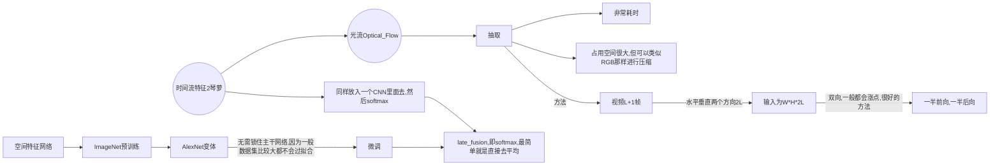
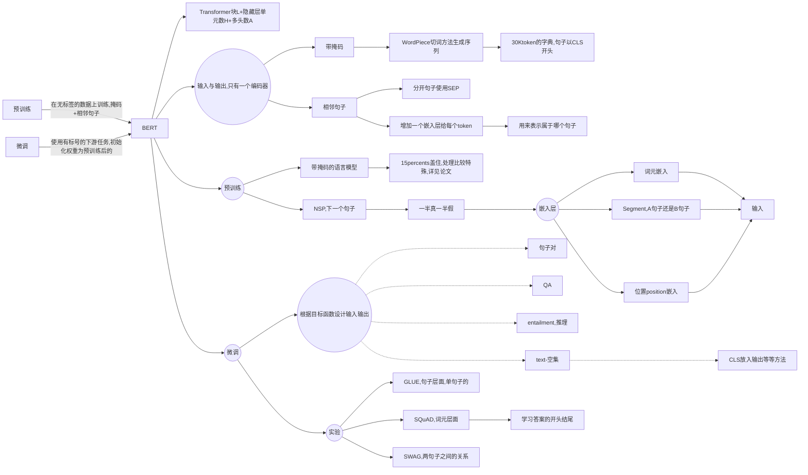
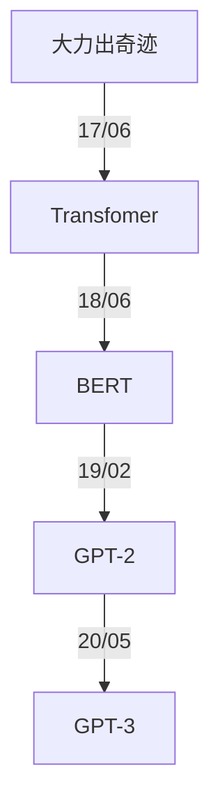
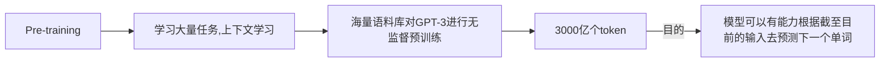
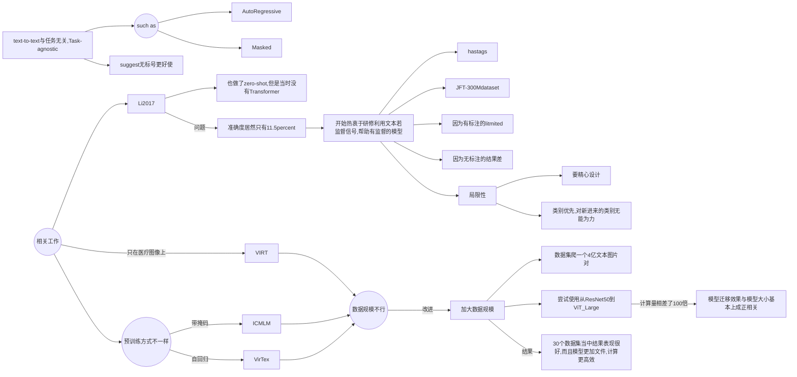
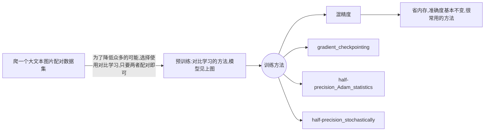
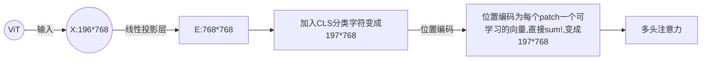
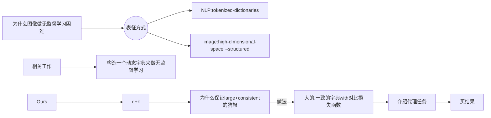

# Neural Network Paper Tutorial, Reading and Notes

This repository contains a list of tutorials, papers, notes of **Neural Network**. If you found any error, please don't hesitate to open an issue or pull request. I will also add some code and other information of these awesome paper.

[TOC]


## :fire: CNN

| 日期     | 标题                                                         | 说明             |
| -------- | ------------------------------------------------------------ | ---------------- |
| 02/13/22 | [AlexNet](https://papers.nips.cc/paper/2012/file/c399862d3b9d6b76c8436e924a68c45b-Paper.pdf) | 深度学习开山之作 |
| 02/13/22 | [ResNet](https://arxiv.org/abs/1512.03385)                   | 残差神经网络     |
| 03/18/22 | [Two-Stream](https://proceedings.neurips.cc/paper/2014/file/00ec53c4682d36f5c4359f4ae7bd7ba1-Paper.pdf) | 视频理解开山之作 |


### AlexNet

[[NIPS 2012] ImageNet Classification with Deep Convolutional Neural Networks](https://papers.nips.cc/paper/2012/file/c399862d3b9d6b76c8436e924a68c45b-Paper.pdf)

* 数据集是1m的图片+1000类别（完整的有8.9m+1万类别）
  * $256 \times 256$的channels数为3的数据集

**数据处理**

* 避免过拟合
  * 数据增强
    * 随机裁$224 \times 224$的出来
    * 通道变换
* DropOut
  * 根据后来研究表明就等价一个$l2$正则项

**模型训练**

* 使用ReLU，简单好用
* SGD

这篇论文写作格式有些不好，没有结论，不过这是深度学习的开创性工作。

### ResNet

[[CVPR 2015]Deep Residual Learning for Image Recognition](https://arxiv.org/abs/1512.03385)

> ResNet

**提出问题**

* 为什么深度up，精度下降
* SGD找不到，并不是overfitting

**理论**

$f(x) = H(x) + x$

* Shortcut Connections
* 实际上他没从根本理论上解释为什么这个设计可以解决问题，但作为CV文章还可以接受

**实现**

* 数据增强
  * [256, 480] resize,随机性更好
  * BN
  * 测试集
    * 当中10-crop testing ？？？
    * resize多个，但感觉太贵，主要用来刷榜
* ResNet-50 与 Resnet-30设计不一样，为了保证计算开销差不多
  * 256-d -> 64 -> 64 -> 256
    * 第一个64和最后256为$1 \times 1$卷积，用来变换通道数
    * 为了学到更多信息

* 为了保证维度可以做相加

  * padding，填0

    ```python
    f = [[[[1,2,3,4],[5,6,7,8]]]]
    x = [[[[1,2],[3,4]]]]
    """x--->[[[[0,1,2,0],[0,3,4,0]]]]"""
    x = tensorflow.pad(x, [[0,0],[0,0],[0,0],[(out_filter-in_filter)//2, (out_filter-in_filter)//2]])
    x = f + x
    ```

  * projection($1 \times 1$卷积)

    * 用于增加维度
    * 所有都使用一下，不过太贵了不划算！


**写作**

* Abstract：关注重点是什么问题，show了我们大概是什么，数据集上成绩如何
* Intro：我们的breakthrough+经典放图+提问题，回答问题。结果展示+解释Resnet设计扩充了Abstract。让不敢兴趣或者不是这个领域的人可以戛然而止，非常好
* Related Word：介绍一下前人工作，和我们工作的对比


### Two-stream Network

[[NIPS 2014]Two-Stream Convolutional Networks for Action Recognition in Videos](https://proceedings.neurips.cc/paper/2014/file/00ec53c4682d36f5c4359f4ae7bd7ba1-Paper.pdf)

> * 视频理解分类开山之作
> * 双流神经网络

**过去问题**

* 一个CNN一般学不到这种动作信息，比手工特征还要差20%
* 既然学不了，我们就教他学
  * 很多时候既然模型不会学，模型和`loss`无法解决问题的时候，采用一些先验信息十分关键(在这里体现为我们去教他学！)。




**痛点**

* 光流
  * 耗时很长很长
  * 占用存储空间很大很大，对IO考验很大
* 为什么基于动作轨迹的方式比同一位置预测效果为差，这里[CVPR2015 Action Recognition with Trajectory-Pooled Deep-Convolutional Descriptors](https://arxiv.org/abs/1505.04868)解决了
* 相机移动的影响，手工特征中会考虑这些信息，文章这里只做了最简单的减去均值的方法

**影响**

* 当模型优化，损失函数调整后仍然无法解决问题的话，那就试着教模型怎么去学！！！

------


##  :telescope: NLP

| 日期     | 标题                                                         | 说明         |
| -------- | ------------------------------------------------------------ | ------------ |
| 02/24/22 | [Transformer](https://arxiv.org/abs/1706.03762)              | 多头注意力   |
| 02/27/22 | [BERT](https://arxiv.org/abs/1810.04805)                     | 预训练与微调 |
| 03/07/22 | [GPT](https://s3-us-west-2.amazonaws.com/openai-assets/research-covers/language-unsupervised/language_understanding_paper.pdf), [GPT-2](https://d4mucfpksywv.cloudfront.net/better-language-models/language_models_are_unsupervised_multitask_learners.pdf), [GPT-3](https://arxiv.org/abs/2005.14165) | 语言模型     |
| 03/20/22 | [Evaluating Large Language Models Trained on Code](https://arxiv.org/abs/2107.03374) |              |
| 03/25/22 | [Competition-Level Code Generation with AlphaCode](https://arxiv.org/abs/2203.07814) |              |


### Transformer

[[NIPS 2017] Attention is All you need](https://arxiv.org/abs/1706.03762)

**特性**

* 泛化性好(generalizes well)

**技术细节**

* 做机器翻译的任务

* Encoder and decoder

  * Encoder

    * 两个sub-layer
    * 输入 dimension: $d_{model} = 512$
    * Layer normalization

    

  * Decoder

    * 带掩码的attention
    * 线性输出层=> softmax

* **Attention**

  * 输出为value的加权和，权重从KQ相似性计算得来
  * Scaled Dot-Product
    * $Attention(Q, K, V) = \text{softmax}(\frac{QK^T}{\sqrt {d_k}}V)$
      * $Q : n \times d_k$
      * $K : m \times d_k$
      * $V : m \times d_V$
      * output:  $n \times d_v$
      * softmax作用在输出的每一行
      * 除以$d_k$避免两端梯度太小无法训练！！！
    * 其他Attention： 加性Attention，可用于三个维度不一致
    * Decoder当中带掩码，权重为-inf（因为不能未卜先知）
  * 多头注意力
    * 投影到不通过Linear（学到不同的模式）
    * 分别计算内积
    * Concat
    * Linear
    * 可利用大矩阵乘法并行计算！

* Posision-wise Feed-Forward Networks（实际上为一个MLP）

  * 用来切分位置
  * 每个词作用于同一个MLP
  * $FFN(x) = max(0, xW_1 + b_1)W_2 + b_2$ 512 ->2048;2048->512

* Embedding

  * 词元 -> 词向量
  * 因为学到$l2-norm$太小，所以权重$\times \sqrt{d_{model}}$

*  Positional Encoding

  * 在输入当中加入时序信息

**训练**

* 正则化：大量Dropout， Label Smoothing 很小
* 同一词根同一token，字典在两种语言中共享（因为embedding权重一样）
* 4.5 million句子对

**写作**

* 很简洁的一篇文章
* 没有太多写作技巧
* 理论解释较为欠缺
* 要讲好一个故事，为什么做这个事情，设计理念是什么，对文章的思考

**未来展望**

* 我们对Transformer理论仍在初期阶段
* 迁移到很多CV的领域也可用
* 因为人对时序信息是多膜体的，Transformer也努力做到和人类似！

### BERT

[BERT: Pre-training of Deep Bidirectiional Transformers for Language Understanding](https://arxiv.org/abs/1810.04805)

> BERT， 代表NLP真的可以做预训练了
>
> * 过去三年最重要的NLP论文

**摘要**

> 这是一篇非常标准的摘要

1. 介绍区别（双向）
2. 泛化性好
3. 数据精度
   1. 绝对精度
   2. 相对精度

**前期工作**

* 任务level

  * token level
  * sentence level

* 过往的方法

  * 基于特征 feature-based
    * ELMO词嵌入
    * 基于RNN的
  * 微调的 fine-tuning
    * Transformer-> GPT
    * 单向的，现在预测未来
  * 两个方法都是同目标函数+单向的

* 局限性=> 我们的方法

  * 看完整的句子（双向）
  * 带掩码的语言模型，类似于完型填空
  * 看原文中两句子是否相邻
  * **均为无监督的学习**

* 论文贡献

  * 双向性，对比以前的数据精度
  * 微调，下游任务的表现

  

**模型架构**



**展望**

* 开启了大模型的开端，亿级别的参数
* 基于前人工作，但效果非常好
* 微调可用于很多NLP任务

**写作**

* 中规中矩的一篇文章
* 简单，暴力，效果好
* 要多些贡献了什么，失去了什么
  * 生成类问题使用BERT较难

### GPT系列

#### [GPT](https://s3-us-west-2.amazonaws.com/openai-assets/research-covers/language-unsupervised/language_understanding_paper.pdf)

**Reviews**



**解决问题**

* 无标号数据下预训练，构建与任务相关的输入
* 利用无监督文本的难点
  * 目标函数
  * 子任务不一致
* 基于Transformer解码器，BERT基于Transformer编码器

**模型思想**

* 预训练

  * 构建语言模型
  * 给出前$k$个词，预测下一个词，最大化似然函数
    * $L_1(U) = \sum_i log P(u_i \mid u_{i-k}, ..., u_{i-1})$
  * 进入Transformer块（输入输出形状不会改变的）

* 微调

  * 给出词元序列$x^1, x^2, ..., x^m$预测标号$y$
  * $L_2(C) = \sum_{(x, y)} log P(y \mid x^1, ..., x^n)$最大化
  * 优化目标函数
    * $L_3(C) = L_2(C) + \lambda * L_1(C)$

  

* 针对不同的NLP任务设计
  * 不变的是预训练好的Transformer块


#### [GPT-2](https://d4mucfpksywv.cloudfront.net/better-language-models/language_models_are_unsupervised_multitask_learners.pdf)

> 如何回应BERT

首先技术路线不能变，仍然坚持要用编码器

**基本思路**

* 提出更大的数据集
* 15亿的参数（1.5B）
* 结果不算很好，但卖点在`zero-shot`,新意度高

**训练技巧**

* 模型与GPT类似
* 微调时候差别较大（==也可以看成刚说没了微调，用下面的方法来代替==）
  * 不再引入特殊标识符`<EOS>`之类的
    * 避免pre-training没有，fine-tining时候模型感到困惑
    * 下游任务不再需要构建出特殊标识符的输入输出
  * 改成`(prompt, text, label)`
    * `prompt`的提示文本可能也会出现在数据集当中，模型可以理解

**疑难解答**

1. 语言模型其实也是在给序列的条件概率建模，即 ![[公式]](https://www.zhihu.com/equation?tex=p%28s_%7Bn-k%7D%2C+...%2C+s_n%7Cs_1%2C+s_2%2C+...%2Cs_%7Bn-k-1%7D%29)
2. 任何的有监督任务，其实都是在估计 ![[公式]](https://www.zhihu.com/equation?tex=p%28output%7Cinput%29) ，通常我们会用特定的网络结构去给任务建模，但如果要做通用模型，它需要对 ![[公式]](https://www.zhihu.com/equation?tex=p%28output%7Cinput%2C+task%29) 建模。对于NLP任务的input和output，我们平常都可以用向量表示，而对于task，其实也是一样的。18年已经有研究对task进行过建模了，这种模型的一条训练样本可以表示为 ![[公式]](https://www.zhihu.com/equation?tex=%28translate%5C+to%5C+french%2C+english%5C+text%2C+french%5C+text%29) ，或者表示为 ![[公式]](https://www.zhihu.com/equation?tex=%28answer%5C+the%5C+question%2C+document%2C+question%2C+answer%29) 。也就是说，已经证实了，**以这种数据形式可以有监督地训练一个single model，其实也就是对一个模型进行==有监督的多任务学习==**。
3. **语言模型=无监督多任务学习**。相比于有监督的多任务学习，语言模型只是不需要显示地定义哪些字段是要预测的输出，所以，实际上有监督的输出只是语言模型序列中的一个子集。举个例子，比如我在训练语言模型时，有一句话“The translation of word Machine Learning in chinese is 机器学习”，那在训练完这句话时，语言模型就自然地将翻译任务和任务的输入输出都学到了。再比如，又碰到一句话“美国的总统是特朗普”，这一句话训练完，也就是一个小的问答了。

4. 如果以上思想懂了，那文章开始的两个问题就迎刃而解：第一个问题答案就是上面的三点。那单向Transformer和双向Transformer的区别，我认为主要是**目标函数**的区别，因为BERT的Masked language model是对 ![[公式]](https://www.zhihu.com/equation?tex=p%28s_k%7Cs_1%2C+..%2C+s_%7Bk-1%7D%2C+s_%7Bk%2B1%7D%2C+...%2C+s_n%29) 进行建模（**完型填空**），这个建模思想的区别，也就使得目前的BERT无法做 ![[公式]](https://www.zhihu.com/equation?tex=p%28output%7Cinput%2C+task%29) 这样的任务。

**数据集**

* `Common Crawl` 中垃圾信息太多
* 改成使用Reddit网站爬下来45million的link，关于英语翻译法语的数据（详见[论文](https://github.com/Gary-code/paper-reading/blob/main/GPT-2.pdf)）

**写作**

* 结果并不好，但新意度高，卖点就是`zero-shot`
* `achieve promising, competetive, and state of the art results depending on task`


#### [GPT-3](https://arxiv.org/abs/2005.14165)

> 技术报告共63页，并非正式发表的论文

**概览**

* 175 billion parameters
* 不再做微调
  * 那么大的模型做微调很可怕
  * 微调效果之所以好，可能是因为你的pre-training过拟合了
* 玩出花样来了，脸不红心不跳的写出一些文本
* 大数据集

**模型架构**

预训练



预训练时候的上下文学习，无微调

* zero/one/**few-shot**
  * task description
    * translate English to chinese
  * examples （如果不是zero-shot，会有一部分带标签的样本）
    * sea => 海
  * prompt 
    * cheese => 

- 情境学习/上下文学习（in-context learning）：在被给定的几个任务示例或一个任务说明的情况下，模型应该能通过简单预测以补全任务中其他的实例。即，情境学习要求预训练模型要对任务本身进行理解。情境学习三种分类的定义和示例如下：

- few-shot learning

  - 定义：允许输入数条范例和一则任务说明
  
  - 示例：向模型输入“这个任务要求将中文翻译为英文。你好->hello，再见->goodbye，购买->purchase，销售->”，然后要求模型预测下一个输出应该是什么，正确答案应为“sell”。
  
  - one-shot learning
  
    - 定义：只允许输入一条范例和一则任务说明

    * 示例：向模型输入“这个任务要求将中文翻译为英文。你好->hello，销售->”，然后要求模型预测下一个输出应该是什么，正确答案应为“sell”。

    - zero-shot learning
    - 定义：不允许输入任何范例，只允许输入一则任务说明
    - 示例：向模型输入“这个任务要求将中文翻译为英文。销售->”，然后要求模型预测下一个输出应该是什么，正确答案应为“sell”。

**训练数据集**

> 基于Common Crawl
>
> * 但数据集太脏，需要净化一下

* Logistic Regression
  * 之前Reddit的作为训练数据
  * 判断Common Crawl上是否干净，保留干净的
* LSH去重
  * Information Retrival的重要算法，面试常考
* 加上一些书籍的数据和维基百科的数据

分配不同的采样率进行采样

**训练过程**

太贵，普通人完全玩不起

* 分布式训练
* 模型分割与数据分割
* 精度**线性**上升，数据量和计算量**指数**增加

超大模型应该选择巨大批量进行分布式训练。每台机器`Batch_Size/n` n为机器数量

* **批量上升，计算性能上升**
* 但对**小模型**来说却**容易过拟合**，所以小模型不建议那么大的批量

所以Batch Size的合理设置十分重要，下面是关于一些Batch Size大小的对比：

| Batch Size           | Small      | Large                |
| -------------------- | ---------- | -------------------- |
| Speed for one update | Same       | Same (not too large) |
| Time for one epoch   | Slower     | **Faster**           |
| Gradient             | Noisy      | Stable               |
| Optimization         | **Better** | Worse                |
| Generalization       | **Better** | Worse                |

**影响**

* 局限性
  * 文本生成较弱，补全文本很好
  * 向前看，不是双向的
    * Transformer解码器
  * 均匀预测，不知道哪个词比较重要
    * 没见过vedio等数据
  * 样本太多太多
  * 到底是从头开始学习，还是纯粹记忆无法解释
  * 太贵，解释性差
* 深远影响
  * 社会各方面

**关于GPT的一些思考**

GPT3这篇文章太长了，而且那么长居然不提一下之前的一些工作，又要读者翻引用文献实在不太好。

* 做研究不要一条路走到黑，做过程你可以一条路走到黑，但是在做研究的时候，你要灵活一些，不要一条路走到黑。你需要尝试从一个新的角度来看问题。

* gpt2还是做语言模型，但是在做到下游任务的时候，会用一个叫做zero-shot的设定，zero-shot是说，在做到下游任务的时候，不需要下游任务的任何标注信息(特殊符号`<EOS>`等)，那么也不需要去重新训练已经预训练好的模型。这样子的好处是我只要训练好一个模型，在任何地方都可以用。
* 如果作者就是在gpt1的基础上用一个更大的数据集训练一个更大的模型，说我的结果比BERT好一些，可能也就好那么一点点，不是好那么多的情况下，大家会觉得gpt2这篇文章就没什么意思了，工程味特别重。那么我换一个角度，选择一个更难的问题，我说做zero-shot。虽然结果可能没那么厉害了，没那么有优势，但是新意度一下就来了。


### CodeX

[Evaluating Large Language Models Trained on Code](https://arxiv.org/abs/2107.03374)

> * GPT-based
>* 做了微调

* 做了一个评估数据集
* `BLUE`对代码评估并不好，所以使用了`param@k`的方法，但这个方法没有排序，`k`很大时不是很好

### AlphaCode

[Competition-Level Code Generation with AlphaCode](https://arxiv.org/abs/2203.07814)

> 打CodeForces，打败一半程序员


------


## :rocket: Multi-Modal

| 日期     | 标题                                  | 说明             |
| -------- | ------------------------------------- | ---------------- |
| 03/09/22 | [CLIP](https://openai.com/blog/clip/) | 多模态预训练模型 |


### [CLIP](https://github.com/Gary-code/paper-reading/blob/main/Learning%20Transferable%20Visual%20Models%20From%20Natural%20Language%20Supervision(CLIP).pdf)

> OpenAI 并未开源其代码，不过开源了他的模型，[可见](https://github.com/openai/CLIP)

* 模型架构


**概览**

* 2021/02提出，方法简单，效果超好
* 衍生出很多有趣的应用
* 迁移性非常好，利用自然语言监督信号


**Abstract**

* 当前视觉系统的问题，有固定的的类别数量
* 文章工作，从**文本中得到监督的信号**
* 直接zero-shot与图片文本配对
* 结果
  * 由于要证明其迁移性非常好
  * CLIP怒刷了30个数据集，其在ImageNet上的准确度居然与ResNet-50一致
  * 但其迁移性远远超越其他模型，转移到其他任务上，其他模型基本就是在乱猜了

**Introduction & Motivating Work**

> 本部分介绍了一些相关工作的发展



**Approach**



想了解更多关于如何在多个GPU训练超大模型的方法，可以见[博客](https://towardsdatascience.com/how-to-scale-training-on-multiple-gpus-dae1041f49d2)

* 讨论
  * 数据集太大不怎么可能overfitting
  * 只做了随机crop的数据增强

```python
# image_encoder - ResNet or Vision Transformer
# text_encoder - CBOW or Text Transformer
# I[n, h, w, c] - minibatch of aligned images  # n为批量大小
# T[n, l] - minibatch of aligned texts
# W_i[d_i, d_e] - learned proj of image to embed
# W_t[d_t, d_e] - learned proj of text to embed
# t - learned temperature parameter
# extract feature representations of each modality
I_f = image_encoder(I) #[n, d_i]
T_f = text_encoder(T) #[n, d_t]
# joint multimodal embedding [n, d_e]
I_e = l2_normalize(np.dot(I_f, W_i), axis=1)  # 投影后归一化
T_e = l2_normalize(np.dot(T_f, W_t), axis=1)   
# scaled pairwise cosine similarities [n, n]
logits = np.dot(I_e, T_e.T) * np.exp(t)
# symmetric loss function
labels = np.arange(n)  # 1:n 因为对角线上的才是正样本
loss_i = cross_entropy_loss(logits, labels, axis=0)
loss_t = cross_entropy_loss(logits, labels, axis=1)
loss = (loss_i + loss_t)/2
```

**Summary**

* Limitation部分写得很好，可以多学习
* 一篇$100 \times 100 \times 100$的论文，不过确实很长


---


## :framed_picture: CV

| 日期     | 标题                                                         | 说明               |
| -------- | ------------------------------------------------------------ | ------------------ |
| 03/30/22 | [ViT](ViT)                                                   | Vision Transformer |
| 04/01/22 | [I3D](https://arxiv.org/abs/1705.07750)                      | 3D CNN             |
| 04/15/22 | [Trajectory-Pooled features](https://arxiv.org/abs/1505.04868) | 视频动作轨道检测   |
| 04/24/22 | [Overview of vedio](https://arxiv.org/abs/2012.06567)        | 为CVPR 2020准备    |

### ViT

[[ICCV 2021] An Image is Worth 16x16 Words: Transformers for Image Recognition at Scale](ViT)

> Vision Transformer
>
> * Transformer 用在CV领域
> * ICCV 21 最佳论文

**Mindmap**

```mermaid
graph LR

all((NLP上Transformer表现很好)) --应用在CV上的难点--> 序列太长 --解决方法--> 224/16=14patch --> train((训练)) --小数据集上差于CNN--> 因为Transformer缺少先验信息,CNN的归纳偏置 --> 转到大数据集上,ViT就表现很好了  --训练方法--> 有监督训练,判别式网络 --> 未来MAE将生成式网络应用到CV上

all --之前工作--> 特征图,窗口,轴注意力等 --> 太难训练了

```

**模型**

* 论文示意图非常清楚
* 核心：图片变成token



**写作**

* 摘要简短易懂
* 导言写得很标准
  * NLP中Transformer思想
  * 应用CV难点，前人努力
  * 买结果，分析结果
* 相关工作写得很好，让不是这个领域的人都可以快速明白你论文干什么
  * NLP中BERT和GPT
  * CV中序列太长前人如何做近似
  * 最相似的论文，前人工作，我们的不一样的地方，**换个角度讲故事**
  * 我们的结果如何
* 结论
  * 买结果，优点是什么
  * 挖坑新模型
    * 迁移到图像分割 `SERT`
    * 迁移到目标检测 `ViT-RCNN`+`DETR(2020)`
      * `DETR`彻底改变出框的规则！`ViT-RCNN`则是迁移到目标检测上
    * 更大`ViT`，自己填坑

### I3D

[[CVPR 2015] Quo Vadis, Action Recognition? A New Model and the Kinetics Dataset](https://arxiv.org/abs/1705.07750)

> * 目前到底用`3D`, `2D`, 还是`Transformer`在视频上还是没有定论！(2022)

**贡献**

* `Kinetics`数据集
  * 做视频必测数据集
  * 但仍然存在不足，其中间抽一部分帧来做分类已经准确率不错了，没有真正让验证模型的学习时序信息的能力
* 模型
  * 双流 + 3D

**对比以往工作**

* 
  * CNN + LSTM
  * 3D CNN
  * 双流神经网络

**训练方法与技巧**

* `Inflated` 将`2D`的模型直接用到`3D`上, 不用自己再花心思设计网络架构
* `2D`预训练的模型参数直接运用到`3D`上，如何使用:
  * 时间维度 $\times N$
  * 可见[代码](https://github.com/dmlc/gluon-cv/blob/master/gluoncv/model_zoo/action_recognition/i3d_resnet.py)

**写作**

* 为了验证数据集的有效性，和分析过去数据集的不足的地方。需要benmark一下以前的方法
  * 在`Kinetics`数据集上用过去的方法进行预训练
  * 在以前的数据集上进行微调
  * 分析得出，效果参差不齐
    * 验证了过去数据集太小了，体现不出来深度学习间**不同模型之间的差异**！
  * 顺理成章总结过去三类方法提出文章的模型(**双流 + 3D**， 如上图`e`所示。)


### Trajectory-Pooled

[[CVPR 2015] Action Recognition with Trajectory-Pooled Deep-Convolutional Descriptors](https://arxiv.org/abs/1505.04868)


### Overview

[[CVPR 2020] A Comprehensive Study of Deep Video Action Recognition (Overview)](https://arxiv.org/abs/2012.06567)

> * 视频理解的综述文章（到2021年）
> * 近两百篇论文
> * 视频动作识别是very hot topic

**发展**

1. Hand-crafted CNN

   * [cvpr 2014 deep video](https://www.cv-foundation.org/openaccess/content_cvpr_2014/html/Karpathy_Large-scale_Video_Classification_2014_CVPR_paper.html)

   * 视频与图片不同就是**多了一个时间轴**

   * 

     * 
       * 更关注视频中间区域
       * 多分辨率

     * 结果
       * 

   * 效果不好，但做了很多基础性的尝试，提出了`spot 1 million`数据集

   * **如何更好处理时间信息**

2. 双流（光流抽取时间信息）
   * 可做方向
     * early fusion [Convolutional Two-Stream Network Fusion for Video Action Recognition](https://arxiv.org/abs/1604.06573)
       * 什么fusion
         * 尝试多种fusion
       * 哪里fusion
         * 
       * Temporal fusion 时间如何结合
         * 
     * 小数据集训练大模型
     * LSTM时序建模 [Beyond Short Snippets: Deep Networks for Video Classification](https://arxiv.org/abs/1503.08909)
       * 多种`pooling`发现`conv pooling`效果最好
       * `LSTM`提升有限，因为`LSTM`应当去学更高级的语义信息，而短视频中语义信息太过接近
     * 长时间视频理解 简单想法非常有效 [paper](https://arxiv.org/abs/1608.00859)
       * 视频分段，段中抽帧
         * 
       * 有用技巧
         * cross modality pretraining
           * 光流如何预训练，扩展维度技巧
         * partial BN
           * 除了第一层，后面全部冻住BN，防止过拟合
         * data augmentation
           * corner cropping 边角裁剪
           * scale-jittering 改变图片长宽比
     
     ```mermaid
     graph LR
     
     deepvideo --> t((two-stream)) --> TSN --> DVOF/TLE全局编码
     
     t --> TDD,轨迹堆叠光流
     t --> Fusion
     t --> LSTM
     ```
   
3. 3D CNN

> * 光流抽取非常**耗时**！tvl-one算法 gpu处理一个视频对要0.06s
>   * 而且**不能实时处理**，1/0.06 = 15fps

* 3D版本VGG，[C3D](https://arxiv.org/abs/1412.0767) 2015年
  * 效果低于同期工作，但卖点在**抽特征**上，省时间！
* [I3D ](https://arxiv.org/abs/1705.07750) 2017年
  * **Inflated**
  * 3D, 而且直接利用2D的参数
  * K400数据集
* 3D网络如何学习长时间信息（借鉴``Transformer``与``self-attention``）
  * [Non-local Neural Networks](https://arxiv.org/abs/1711.07971)
    * spacetime 自注意力取代LSTM了
  * [SlowFast Networks for Video Recognition](https://arxiv.org/abs/1812.03982)
    * 大输入小模型，小输入大模型，两个网络分支


4. video Transformer(该综述没有，`cvpr 2022`)

* [Timesformer](https://arxiv.org/abs/2102.05095) ICML 2021
  * 可以处理超过1min的长视频
  * 
  * 
  

## :sunrise: Contrast Learning

| 日期     | 标题                                       | 说明              |
| -------- | ------------------------------------------ | ----------------- |
| 04/04/22 | [MoCo](https://arxiv.org/abs/1911.05722)   | 动量对比学习+队列 |
| 04/26/22 | [SimCLR](https://arxiv.org/abs/2002.05709) |                   |
|          |                                            |                   |
|          |                                            |                   |


### MoCo

[[CVPR 2020] Momentum Contrast for Unsupervised Visual Representation Learning](https://arxiv.org/abs/1911.05722)

> 动量对比学习
>
> * 对比学习简单好用且强大
> * 无监督学习真的可以
> * 对比学习相关讲解[博客链接](https://muyuuuu.github.io/2021/12/28/SSL-intro/)
> * 本文真的是细节满满！！！

**什么是对比学习(Contrast Learning)**

* 只需要哪几个样本相似，或者说哪几个特征函数在相邻的区域里
* 自监督学习，通过巧妙设计代理任务来**定义规则**进行**正负样本的划分**
  * 例子：instance discrimination
    * $N$张无标注的图片当中，对$x_i$进行Tranformation(crop和augmentation) => $x^{1}_i$,$x^{1}_2$...。他们之间为正样本
    * 那么负样本就是其他所有其他的图片$x_j,j \ne i$

**摘要**

* 介绍我们的做法：就是一个字典查询问题
  * 队列实现
  * 移动平均的encoder
* 结果相当惊人，在下游任务中表现及其出色

**引言**



**相关工作**

1. loss

   * 类型有：
     * 生成式网络
     * 判别式网络（ex: 在那个方位）
     * 对比学习（目标一直在变，由字典来决定）
     * 对抗性网络

   2. 下游任务
      * 感兴趣可以自行了解
      * 整张图片重构
      * 上下文重构
      * 上色
      * 伪标签......

**方法**


* 损失函数 

$$
\mathcal{L}_{q}=-\log \frac{\exp \left(q \cdot k_{+} / \tau\right)}{\sum_{i=0}^{K} \exp \left(q \cdot k_{i} / \tau\right)}
$$

注意有 $K$个negative sample


* **使用队列**

  * 先进先出
  * 大小灵活
  * 计算开销小
  * 每次进去一个mini-batch，出来一个mini-batch

* **动量更新**

  * 队列太长无法梯度回传怎么办
  * 如果只用一个 `mini-batch` 的梯度更新右侧网络，或者说右侧网络只掌握一个 `mini-batch` 的表示，那右侧网络直接输出和左侧网络一样的东西不就行了，这样损失很小，但什么也没学到。因此，不能用一个 `mini-batch` 的梯度去更新右侧网络。
  * 如果将$f_q$每次给$f_k$，那么更更新太快，每次的mini-batch的$k$的encoder差距太大了，一致性美女办法保证
  * 因此使用:

  $$
  \theta_{\mathrm{k}} \leftarrow m \theta_{\mathrm{k}}+(1-m) \theta_{\mathrm{q}}
  $$

  * 发现，$m=0.999$时比$m=0.9$时效果都要好！前者意味着更新非常缓慢
  * 充分利用队列：缓慢梯度动量更新

* 简介易懂的伪代码，**强烈建议看一下开源的[代码](https://github.com/facebookresearch/moco)**

  ```python
  # f_q, f_k: encoder networks for query and key
  # queue: dictionary as a queue of K keys (CxK) 128*65536(256*256)
  # m: momentum
  # t: temperature
  f_k.params = f_q.params # initialize
  for x in loader: # load a minibatch x with N samples
      x_q = aug(x) # a randomly augmented version
      x_k = aug(x) # another randomly augmented version
      q = f_q.forward(x_q) # queries: NxC (256*168)
      k = f_k.forward(x_k) # keys: NxC
      k = k.detach() # no gradient to keys
      # positive logits: Nx1
      l_pos = bmm(q.view(N,1,C), k.view(N,C,1))
      # negative logits: NxK
      l_neg = mm(q.view(N,C), queue.view(C,K))
      # logits: Nx(1+K)
      logits = cat([l_pos, l_neg], dim=1)
      # contrastive loss, Eqn.(1)
      labels = zeros(N) # positives are the 0-th
      loss = CrossEntropyLoss(logits/t, labels)
      # SGD update: query network
      loss.backward()
      update(f_q.params)
      # momentum update: key network
      f_k.params = m*f_k.params+(1-m)*f_q.params
      # update dictionary
      enqueue(queue, k) # enqueue the current minibatch
      dequeue(queue) # dequeue the earliest minibatch
  ```

  

**实验**

> 本文做的实验非常有说服力，证明`MoCo`非常优秀。

* 实验细节
  * 都是冻住骨干网络，微调，学一个多分类头。
* grid search后，找到了超大的学习率30，**启发人们对比学习学到的特征与有监督学习学到的有什么不一样。**
* 消融实验 Ablation Experiment
  * **有什么贡献就做什么消融实验去验证**
  * 队列的好处
    * 与`memory bank`和`SimCLR`来进行对比
  * 动量的好处
    * 之前把query编码器参数给过来发现无法训练`training loss oscillates`震荡！同时设置其他动量值(0.9 ~ 0.999)。
  * 在一些基于像素的任务上对比有监督方法稍显逊色意外，其他都很厉害。
    * instance segmentation
    * semantic segmentation

**结论与讨论**

* 结果好
* 但是数据集大了提升会比较学一些
* 启发未来的MAE，将代理任务搞成Mask auto-encoding的形式（两年前挖的坑，Kaiming自己来补，很有远见！）


**写作**

在介绍动量对比学习前，写了一段承上启下，再次强调**研究动机**，**为什么提出MoCo**，很好的写作方式。

上游任务和下游任务上都对`memory bank`和`SimCLR`进行对比。非常有说服力。

`Our hypothesis is that good features can be learned by a large dictionary that covers a rich set of negative samples, while the encoder for the dictionary keys is kept as consistent as possible despite its evolution.`

`Based on this motivation, we present Momentum Contrast as described next.`

`Remarkably, in all these tasks, MoCo pre-trained on IG-1B is consistently better than MoCo pre-trained on IN-1M. This shows that MoCo can perform well on this large-scale, relatively uncurated dataset. This represents ascenario towards real-world unsupervised learning.`

### SimCLR

[[ICML 2020] A Simple Framework for Contrastive Learning of Visual Representations](https://arxiv.org/abs/2002.05709)

> * Google 无脑TPU


## :pick: Other Related Topic

| 日期     | 标题                                         | 说明     |
| -------- | -------------------------------------------- | -------- |
| 04/21/22 | [Sinkhorn](https://arxiv.org/abs/1802.08665) | 排序网络 |
|          |                                              |          |
|          |                                              |          |
|          |                                              |          |

### Sinkhorn Network

[[ICML 2018] Learning Latent Permutations with Gumbel-Sinkhorn Networks](https://arxiv.org/abs/1802.08665)

**思路**

* Gumbel-Sinkhorn的基本思路是

  * 一个排列结果实际上等于原序列乘以一个置换矩阵。

  * 可以用Sinkhorn算子，以一种连续化的思路逼近这个置换矩阵，这幅图展示了置换矩阵是怎样将向量中的各个元素重新排序的：

    

  * 通过这种转化之后，排列问题就转化成了**置换矩阵的学习**问题

  * 置换矩阵的特点是每行、每列都只有一个1，其他元素都是0。

* sinkorn算子

  * 指数化整个矩阵
  * 对行和列做归一化
  * 随机初始化矩阵无限接近一个置换矩阵

* [具体公式](https://zhuanlan.zhihu.com/p/110951790)


### Pathways

* Google提出的下一代AI计算框架
* 和谷歌的`tensorflow`和`TPU`深度绑定
* [related blog](https://blog.google/technology/ai/introducing-pathways-next-generation-ai-architecture/)
