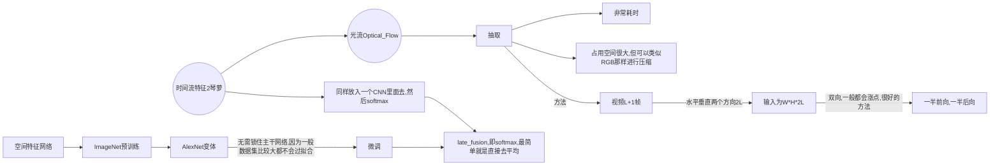
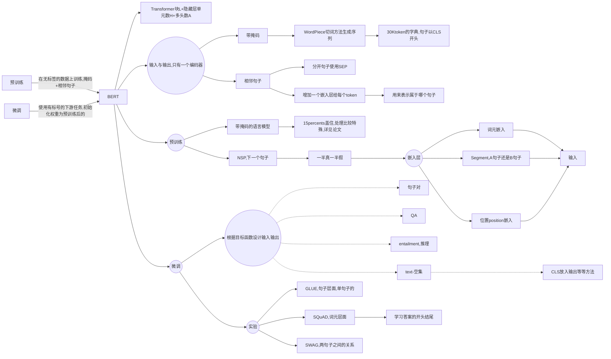
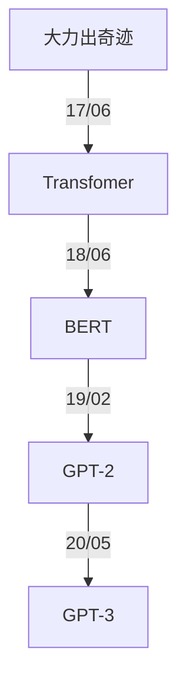
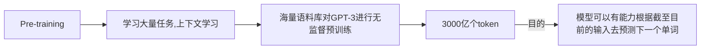
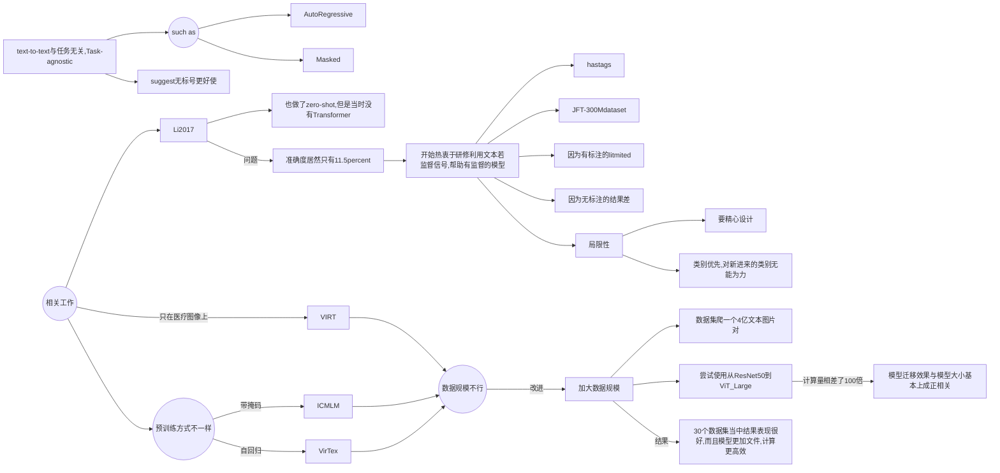
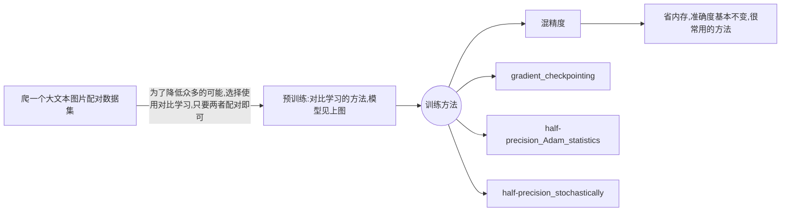

# Neural Network Paper Tutorial, Reading and Notes

This repository contains a list of tutorials, papers, notes of **Neural Network**. If you found any error, please don't hesitate to open an issue or pull request. I will also add some code and other information of these awesome paper.

------


## :fire: CNN

| 日期     | 标题                                                         | 说明             |
| -------- | ------------------------------------------------------------ | ---------------- |
| 02/13/22 | [AlexNet](https://papers.nips.cc/paper/2012/file/c399862d3b9d6b76c8436e924a68c45b-Paper.pdf) |                  |
| 02/13/22 | [ResNet](https://arxiv.org/abs/1512.03385)                   |                  |
| 03/18/22 | [Two-Stream](https://proceedings.neurips.cc/paper/2014/file/00ec53c4682d36f5c4359f4ae7bd7ba1-Paper.pdf) | 视频理解开山之作 |


### [ImageNet Classification with Deep Convolutional Neural Networks](https://github.com/Gary-code/paper-reading/blob/main/ImageNet%20Classification%20with%20Deep%20Convolutional.pdf)

> AlexNet


* 数据集是1m的图片+1000类别（完整的有8.9m+1万类别）
  * $256 \times 256$的channels数为3的数据集

#### 数据处理

* 避免过拟合
  * 数据增强
    * 随机裁$224 \times 224$的出来
    * 通道变换
* DropOut
  * 根据后来研究表明就等价一个$l2$正则项

#### 模型训练

* 使用ReLU，简单好用
* SGD

这篇论文写作格式有些不好，没有结论，不过这是深度学习的开创性工作。

### [Deep Residual Learning for Image Recognition](https://github.com/Gary-code/paper-reading/blob/main/Deep%20Residual%20Learning%20for%20Image%20Recognition.pdf)

> ResNet

#### 提出问题

* 为什么深度up，精度下降
* SGD找不到，并不是overfitting

#### 理论

$f(x) = H(x) + x$

* Shortcut Connections
* 实际上他没从根本理论上解释为什么这个设计可以解决问题，但作为CV文章还可以接受

#### 实现

* 数据增强
  * [256, 480] resize,随机性更好
  * BN
  * 测试集
    * 当中10-crop testing ？？？
    * resize多个，但感觉太贵，主要用来刷榜
* ResNet-50 与 Resnet-30设计不一样，为了保证计算开销差不多
  * 256-d -> 64 -> 64 -> 256
    * 第一个64和最后256为$1 \times 1$卷积，用来变换通道数
    * 为了学到更多信息

* 为了保证维度可以做相加

  * padding，填0

    ```python
    f = [[[[1,2,3,4],[5,6,7,8]]]]
    x = [[[[1,2],[3,4]]]]
    """x--->[[[[0,1,2,0],[0,3,4,0]]]]"""
    x = tensorflow.pad(x, [[0,0],[0,0],[0,0],[(out_filter-in_filter)//2, (out_filter-in_filter)//2]])
    x = f + x
    ```

  * projection($1 \times 1$卷积)

    * 用于增加维度
    * 所有都使用一下，不过太贵了不划算！


#### 写作

* Abstract：关注重点是什么问题，show了我们大概是什么，数据集上成绩如何
* Intro：我们的breakthrough+经典放图+提问题，回答问题。结果展示+解释Resnet设计扩充了Abstract。让不敢兴趣或者不是这个领域的人可以戛然而止，非常好
* Related Word：介绍一下前人工作，和我们工作的对比


### [Two-Stream Convolutional Networks for Action Recognition in Videos](https://github.com/Gary-code/paper-reading/blob/main/NIPS-2014-two-stream-convolutional-networks-for-action-recognition-in-videos-Paper.pdf)

> * 视频理解分类开山之作
> * 双流神经网络

#### 过去问题

* 一个CNN一般学不到这种动作信息，比手工特征还要差20%
* 既然学不了，我们就教他学
  * 很多时候既然模型不会学，模型和`loss`无法解决问题的时候，采用一些先验信息十分关键(在这里体现为我们去教他学！)。




#### 痛点

* 光流
  * 耗时很长很长
  * 占用存储空间很大很大，对IO考验很大
* 为什么基于动作轨迹的方式比同一位置预测效果为差，这里[CVPR2015 Action Recognition with Trajectory-Pooled Deep-Convolutional Descriptors](https://arxiv.org/abs/1505.04868)解决了
* 相机移动的影响，手工特征中会考虑这些信息，文章这里只做了最简单的减去均值的方法

#### 影响

* 当模型优化，损失函数调整后仍然无法解决问题的话，那就试着教模型怎么去学！！！

------


##  :telescope: NLP

| 日期     | 标题                                                         | 说明 |
| -------- | ------------------------------------------------------------ | ---- |
| 02/24/22 | [Transformer](https://arxiv.org/abs/1706.03762)              |      |
| 02/27/22 | [BERT](https://arxiv.org/abs/1810.04805)                     |      |
| 03/07/22 | [GPT](https://s3-us-west-2.amazonaws.com/openai-assets/research-covers/language-unsupervised/language_understanding_paper.pdf), [GPT-2](https://d4mucfpksywv.cloudfront.net/better-language-models/language_models_are_unsupervised_multitask_learners.pdf), [GPT-3](https://arxiv.org/abs/2005.14165) |      |
| 03/20/22 | [Evaluating Large Language Models Trained on Code](https://arxiv.org/abs/2107.03374) |      |


### [Attention is All you need](https://github.com/Gary-code/paper-reading/blob/main/Attention%20Is%20All%20You%20Need.pdf)

> Transformer

#### 特性

* 泛化性好(generalizes well)

#### 技术细节

* 做机器翻译的任务

* Encoder and decoder

  * Encoder

    * 两个sub-layer
    * 输入 dimension: $d_{model} = 512$
    * Layer normalization

    

  * Decoder

    * 带掩码的attention
    * 线性输出层=> softmax

* **Attention**

  * 输出为value的加权和，权重从KV相似性计算得来
  * Scaled Dot-Product
    * $Attention(Q, K, V) = \text{softmax}(\frac{QK^T}{\sqrt {d_k}}V)$
      * $Q : n \times d_k$
      * $K : m \times d_k$
      * $V : m \times d_V$
      * output:  $n \times d_v$
      * softmax作用在输出的每一行
      * 除以$d_k$避免两端梯度太小无法训练！！！
    * 其他Attention： 加性Attention，可用于三个维度不一致
    * Decoder当中带掩码，权重为-inf（因为不能未卜先知）
  * 多头注意力
    * 投影到不通过Linear（学到不同的模式）
    * 分别计算内积
    * Concat
    * Linear
    * 可利用大矩阵乘法并行计算！

* Posision-wise Feed-Forward Networks（实际上为一个MLP）

  * 用来切分位置
  * 每个词作用于同一个MLP
  * $FFN(x) = max(0, xW_1 + b_1)W_2 + b_2$ 512 ->2048;2048->512

* Embedding

  * 词元 -> 词向量
  * 因为学到$l2-norm$太小，所以权重$\times \sqrt{d_{model}}$

*  Positional Encoding

  * 在输入当中加入时序信息


#### 训练

* 正则化：大量Dropout， Label Smoothing 很小
* 同一词根同一token，字典在两种语言中共享（因为embedding权重一样）
* 4.5 million句子对


#### 写作

* 很简洁的一篇文章
* 没有太多写作技巧
* 理论解释较为欠缺
* 要讲好一个故事，为什么做这个事情，设计理念是什么，对文章的思考


#### 未来展望

* 我们对Transformer理论仍在初期阶段
* 迁移到很多CV的领域也可用
* 因为人对时序信息是多膜体的，Transformer也努力做到和人类似！


### [BERT: Pre-training of Deep Bidirectiional Transformers for Language Understanding](https://github.com/Gary-code/paper-reading/blob/main/BERT%EF%BC%9APre-training%20of%20Deep%20Bidirectional%20Transformers%20for.pdf)

> BERT， 代表NLP真的可以做预训练了
>
> * 过去三年最重要的NLP论文

#### 摘要

> 这是一篇非常标准的摘要

1. 介绍区别（双向）
2. 泛化性好
3. 数据精度
   1. 绝对精度
   2. 相对精度

#### 前期工作

* 任务level

  * token level
  * sentence level

* 过往的方法

  * 基于特征 feature-based
    * ELMO词嵌入
    * 基于RNN的
  * 微调的 fine-tuning
    * Transformer-> GPT
    * 单向的，现在预测未来
  * 两个方法都是同目标函数+单向的

* 局限性=> 我们的方法

  * 看完整的句子（双向）
  * 带掩码的语言模型，类似于完型填空
  * 看原文中两句子是否相邻
  * **均为无监督的学习**

* 论文贡献

  * 双向性，对比以前的数据精度
  * 微调，下游任务的表现

  

#### 模型架构




#### 展望

* 开启了大模型的开端，亿级别的参数
* 基于前人工作，但效果非常好
* 微调可用于很多NLP任务

#### 写作

* 中规中矩的一篇文章
* 简单，暴力，效果好
* 要多些贡献了什么，失去了什么
  * 生成类问题使用BERT较难


### [GPT](https://github.com/Gary-code/paper-reading/blob/main/GPT.pdf)

#### Reviews



#### 解决问题

* 无标号数据下预训练，构建与任务相关的输入
* 利用无监督文本的难点
  * 目标函数
  * 子任务不一致
* 基于Transformer解码器，BERT基于Transformer编码器

#### 模型思想

* 预训练

  * 构建语言模型
  * 给出前$k$个词，预测下一个词，最大化似然函数
    * $L_1(U) = \sum_i log P(u_i \mid u_{i-k}, ..., u_{i-1})$
  * 进入Transformer块（输入输出形状不会改变的）

* 微调

  * 给出词元序列$x^1, x^2, ..., x^m$预测标号$y$
  * $L_2(C) = \sum_{(x, y)} log P(y \mid x^1, ..., x^n)$最大化
  * 优化目标函数
    * $L_3(C) = L_2(C) + \lambda * L_1(C)$

  

* 针对不同的NLP任务设计
  * 不变的是预训练好的Transformer块


### [GPT-2](https://github.com/Gary-code/paper-reading/blob/main/GPT-2.pdf)

> 如何回应BERT

首先技术路线不能变，仍然坚持要用编码器


#### 基本思路

* 提出更大的数据集
* 15亿的参数（1.5B）
* 结果不算很好，但卖点在`zero-shot`,新意度高

#### 训练技巧

* 模型与GPT类似
* 微调时候差别较大（==也可以看成刚说没了微调，用下面的方法来代替==）
  * 不再引入特殊标识符`<EOS>`之类的
    * 避免pre-training没有，fine-tining时候模型感到困惑
    * 下游任务不再需要构建出特殊标识符的输入输出
  * 改成`(prompt, text, label)`
    * `prompt`的提示文本可能也会出现在数据集当中，模型可以理解

#### 疑难解答

1. 语言模型其实也是在给序列的条件概率建模，即 ![[公式]](https://www.zhihu.com/equation?tex=p%28s_%7Bn-k%7D%2C+...%2C+s_n%7Cs_1%2C+s_2%2C+...%2Cs_%7Bn-k-1%7D%29)
2. 任何的有监督任务，其实都是在估计 ![[公式]](https://www.zhihu.com/equation?tex=p%28output%7Cinput%29) ，通常我们会用特定的网络结构去给任务建模，但如果要做通用模型，它需要对 ![[公式]](https://www.zhihu.com/equation?tex=p%28output%7Cinput%2C+task%29) 建模。对于NLP任务的input和output，我们平常都可以用向量表示，而对于task，其实也是一样的。18年已经有研究对task进行过建模了，这种模型的一条训练样本可以表示为 ![[公式]](https://www.zhihu.com/equation?tex=%28translate%5C+to%5C+french%2C+english%5C+text%2C+french%5C+text%29) ，或者表示为 ![[公式]](https://www.zhihu.com/equation?tex=%28answer%5C+the%5C+question%2C+document%2C+question%2C+answer%29) 。也就是说，已经证实了，**以这种数据形式可以有监督地训练一个single model，其实也就是对一个模型进行==有监督的多任务学习==**。
3. **语言模型=无监督多任务学习**。相比于有监督的多任务学习，语言模型只是不需要显示地定义哪些字段是要预测的输出，所以，实际上有监督的输出只是语言模型序列中的一个子集。举个例子，比如我在训练语言模型时，有一句话“The translation of word Machine Learning in chinese is 机器学习”，那在训练完这句话时，语言模型就自然地将翻译任务和任务的输入输出都学到了。再比如，又碰到一句话“美国的总统是特朗普”，这一句话训练完，也就是一个小的问答了。

4. 如果以上思想懂了，那文章开始的两个问题就迎刃而解：第一个问题答案就是上面的三点。那单向Transformer和双向Transformer的区别，我认为主要是**目标函数**的区别，因为BERT的Masked language model是对 ![[公式]](https://www.zhihu.com/equation?tex=p%28s_k%7Cs_1%2C+..%2C+s_%7Bk-1%7D%2C+s_%7Bk%2B1%7D%2C+...%2C+s_n%29) 进行建模（**完型填空**），这个建模思想的区别，也就使得目前的BERT无法做 ![[公式]](https://www.zhihu.com/equation?tex=p%28output%7Cinput%2C+task%29) 这样的任务。

#### 数据集

* `Common Crawl` 中垃圾信息太多
* 改成使用Reddit网站爬下来45million的link，关于英语翻译法语的数据（详见[论文](https://github.com/Gary-code/paper-reading/blob/main/GPT-2.pdf)）

#### 写作

* 结果并不好，但新意度高，卖点就是`zero-shot`
* `achieve promising, competetive, and state of the art results depending on task`


### [GPT-3](https://github.com/Gary-code/paper-reading/blob/main/GPT-3.pdf)

> 技术报告共63页，并非正式发表的论文

#### 概览

* 175 billion parameters
* 不再做微调
  * 那么大的模型做微调很可怕
  * 微调效果之所以好，可能是因为你的pre-training过拟合了
* 玩出花样来了，脸不红心不跳的写出一些文本
* 大数据集

#### 模型架构

##### 预训练



##### 预训练时候的上下文学习，无微调

* zero/one/**few-shot**
  * task description
    * translate English to chinese
  * examples （如果不是zero-shot，会有一部分带标签的样本）
    * sea => 海
  * prompt 
    * cheese => 

- 情境学习/上下文学习（in-context learning）：在被给定的几个任务示例或一个任务说明的情况下，模型应该能通过简单预测以补全任务中其他的实例。即，情境学习要求预训练模型要对任务本身进行理解。情境学习三种分类的定义和示例如下：

- few-shot learning

  - 定义：允许输入数条范例和一则任务说明
  
  - 示例：向模型输入“这个任务要求将中文翻译为英文。你好->hello，再见->goodbye，购买->purchase，销售->”，然后要求模型预测下一个输出应该是什么，正确答案应为“sell”。
  
  - one-shot learning
  
    - 定义：只允许输入一条范例和一则任务说明

    * 示例：向模型输入“这个任务要求将中文翻译为英文。你好->hello，销售->”，然后要求模型预测下一个输出应该是什么，正确答案应为“sell”。

    - zero-shot learning
    - 定义：不允许输入任何范例，只允许输入一则任务说明
    - 示例：向模型输入“这个任务要求将中文翻译为英文。销售->”，然后要求模型预测下一个输出应该是什么，正确答案应为“sell”。

#### 训练数据集

> 基于Common Crawl
>
> * 但数据集太脏，需要净化一下

* Logistic Regression
  * 之前Reddit的作为训练数据
  * 判断Common Crawl上是否干净，保留干净的
* LSH去重
  * Information Retrival的重要算法，面试常考
* 加上一些书籍的数据和维基百科的数据

分配不同的采样率进行采样


#### 训练过程

太贵，普通人完全玩不起

* 分布式训练
* 模型分割与数据分割
* 精度**线性**上升，数据量和计算量**指数**增加

超大模型应该选择巨大批量进行分布式训练。每台机器`Batch_Size/n` n为机器数量

* **批量上升，计算性能上升**
* 但对**小模型**来说却**容易过拟合**，所以小模型不建议那么大的批量

所以Batch Size的合理设置十分重要，下面是关于一些Batch Size大小的对比：

| Batch Size           | Small      | Large                |
| -------------------- | ---------- | -------------------- |
| Speed for one update | Same       | Same (not too large) |
| Time for one epoch   | Slower     | **Faster**           |
| Gradient             | Noisy      | Stable               |
| Optimization         | **Better** | Worse                |
| Generalization       | **Better** | Worse                |

#### 影响

* 局限性
  * 文本生成较弱，补全文本很好
  * 向前看，不是双向的
    * Transformer解码器
  * 均匀预测，不知道哪个词比较重要
    * 没见过vedio等数据
  * 样本太多太多
  * 到底是从头开始学习，还是纯粹记忆无法解释
  * 太贵，解释性差
* 深远影响
  * 社会各方面

#### 关于GPT的一些思考

GPT3这篇文章太长了，而且那么长居然不提一下之前的一些工作，又要读者翻引用文献实在不太好。

* 做研究不要一条路走到黑，做过程你可以一条路走到黑，但是在做研究的时候，你要灵活一些，不要一条路走到黑。你需要尝试从一个新的角度来看问题。

* gpt2还是做语言模型，但是在做到下游任务的时候，会用一个叫做zero-shot的设定，zero-shot是说，在做到下游任务的时候，不需要下游任务的任何标注信息(特殊符号`<EOS>`等)，那么也不需要去重新训练已经预训练好的模型。这样子的好处是我只要训练好一个模型，在任何地方都可以用。
* 如果作者就是在gpt1的基础上用一个更大的数据集训练一个更大的模型，说我的结果比BERT好一些，可能也就好那么一点点，不是好那么多的情况下，大家会觉得gpt2这篇文章就没什么意思了，工程味特别重。那么我换一个角度，选择一个更难的问题，我说做zero-shot。虽然结果可能没那么厉害了，没那么有优势，但是新意度一下就来了。


### [Evaluating Large Language Models Trained on Code](https://arxiv.org/abs/2107.03374)

> CodeX
>
> * GPT-based
> * 做了微调

* 做了一个评估数据集
* `BLUE`对代码评估并不好，所以使用了`param@k`的方法，但这个方法没有排序，`k`很大时不是很好


### [Evaluating Large Language Models Trained on Code](https://arxiv.org/abs/2107.03374)


------


## :rocket: Multi-Modal

| 日期     | 标题                                  | 说明 |
| -------- | ------------------------------------- | ---- |
| 03/09/22 | [CLIP](https://openai.com/blog/clip/) |      |


### [CLIP](https://github.com/Gary-code/paper-reading/blob/main/Learning%20Transferable%20Visual%20Models%20From%20Natural%20Language%20Supervision(CLIP).pdf)

> OpenAI 并未开源其代码，不过开源了他的模型，[可见](https://github.com/openai/CLIP)

* 模型架构


#### 概览

* 2021/02提出，方法简单，效果超好
* 衍生出很多有趣的应用
* 迁移性非常好，利用自然语言监督信号


#### Abstract

* 当前视觉系统的问题，有固定的的类别数量
* 文章工作，从**文本中得到监督的信号**
* 直接zero-shot与图片文本配对
* 结果
  * 由于要证明其迁移性非常好
  * CLIP怒刷了30个数据集，其在ImageNet上的准确度居然与ResNet-50一致
  * 但其迁移性远远超越其他模型，转移到其他任务上，其他模型基本就是在乱猜了

#### Introduction & Motivating Work

> 本部分介绍了一些相关工作的发展



#### Approach



想了解更多关于如何在多个GPU训练超大模型的方法，可以见[博客](https://towardsdatascience.com/how-to-scale-training-on-multiple-gpus-dae1041f49d2)

* 讨论
  * 数据集太大不怎么可能overfitting
  * 只做了随机crop的数据增强

```python
# image_encoder - ResNet or Vision Transformer
# text_encoder - CBOW or Text Transformer
# I[n, h, w, c] - minibatch of aligned images  # n为批量大小
# T[n, l] - minibatch of aligned texts
# W_i[d_i, d_e] - learned proj of image to embed
# W_t[d_t, d_e] - learned proj of text to embed
# t - learned temperature parameter
# extract feature representations of each modality
I_f = image_encoder(I) #[n, d_i]
T_f = text_encoder(T) #[n, d_t]
# joint multimodal embedding [n, d_e]
I_e = l2_normalize(np.dot(I_f, W_i), axis=1)  # 投影后归一化
T_e = l2_normalize(np.dot(T_f, W_t), axis=1)   
# scaled pairwise cosine similarities [n, n]
logits = np.dot(I_e, T_e.T) * np.exp(t)
# symmetric loss function
labels = np.arange(n)  # 1:n 因为对角线上的才是正样本
loss_i = cross_entropy_loss(logits, labels, axis=0)
loss_t = cross_entropy_loss(logits, labels, axis=1)
loss = (loss_i + loss_t)/2
```

#### Summary

* Limitation部分写得很好，可以多学习
* 一篇$100 \times 100 \times 100$的论文，不过确实很长

